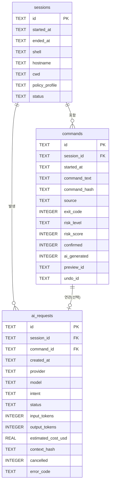
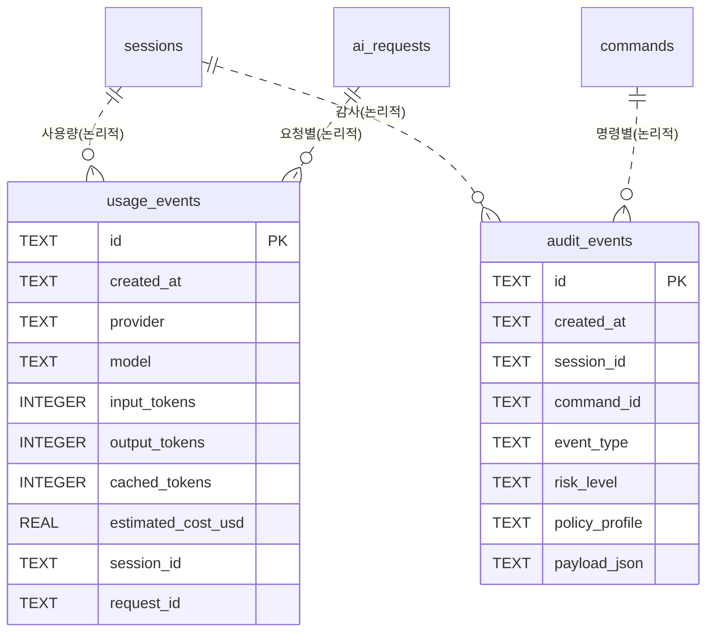
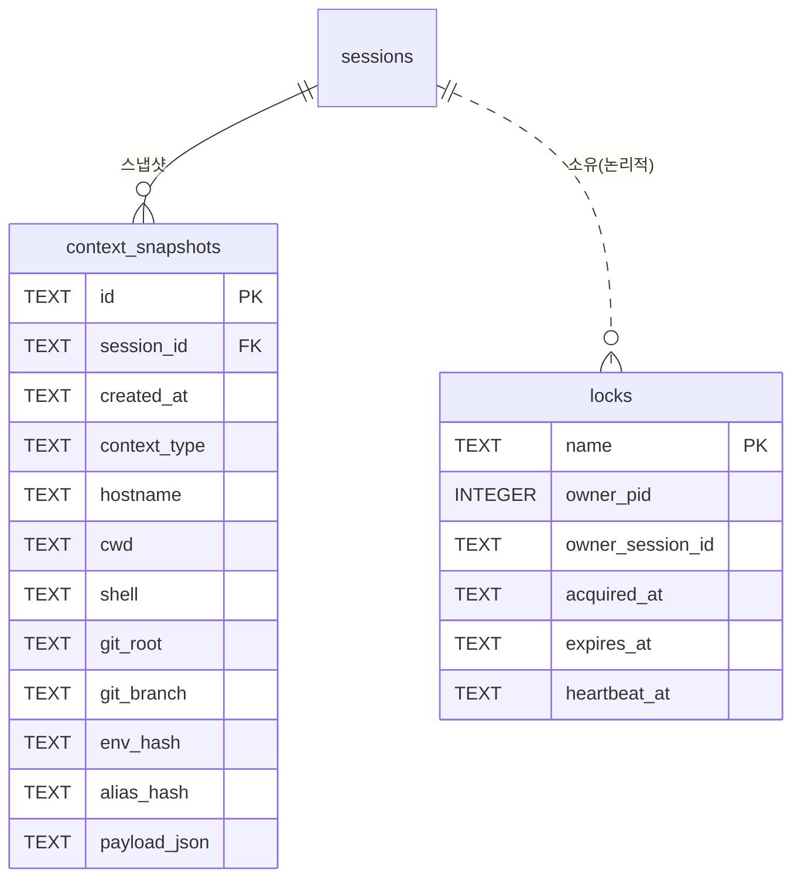
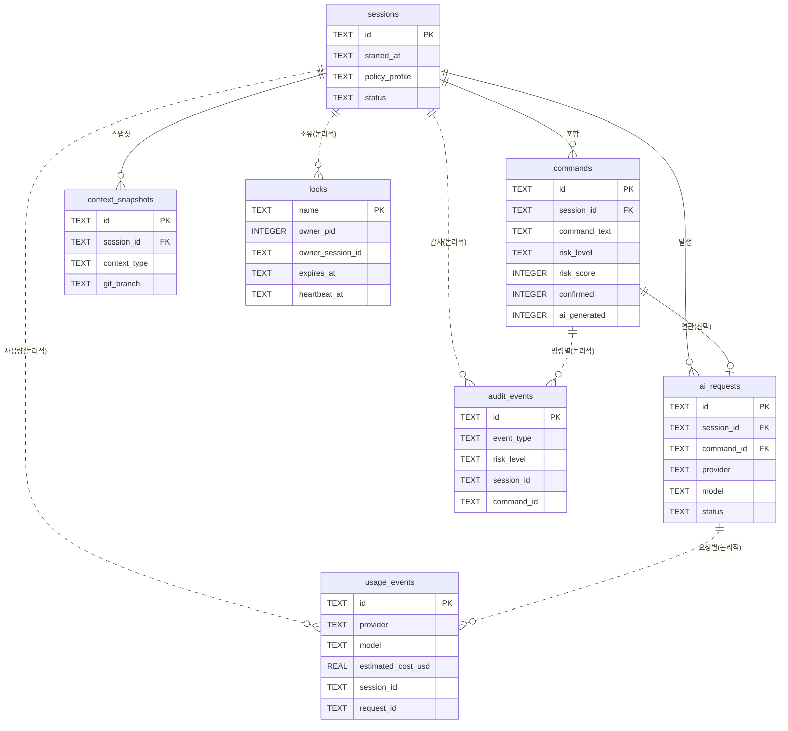

# 02. ERD 문서

> **프로젝트명**: AI CLI 통합 리눅스 터미널
> **버전**: v1.0
> **작성일**: 2026-06-01
> **기술 스택**: Rust · ratatui · tokio · portable-pty · SQLite (대안: Go)

---

## 0. 문서 개요

본 프로젝트의 데이터베이스는 **데몬 없는(daemon-less) 단일 SQLite 파일** `ai-terminal.db`(WAL 모드) 하나로 구성된다. 별도의 DB 서버를 두지 않고, 다중 터미널 프로세스 간 일관성은 `locks` 테이블과 `locks/` 디렉터리의 advisory 파일 락 두 층으로 직렬화한다.

- 저장 위치: `~/.local/share/ai-terminal/ai-terminal.db`
- 정본 DDL: `06-mvp-implementation-spec.md` §31.2 (본 문서가 ERD 권위 사본)
- 테이블 7개: `sessions`, `commands`, `ai_requests`, `usage_events`, `audit_events`, `context_snapshots`, `locks`
- ID 타입: 모든 PK는 애플리케이션이 생성하는 `TEXT`(예: `sess_123`, `cmd_123`, `req_123`). 자동 증가 정수 PK는 사용하지 않는다.
- 시각 타입: 모든 시각 컬럼은 ISO 8601 문자열(`TEXT`, 예: `2026-06-01T10:30:00+09:00`).
- 불리언 표현: SQLite에 boolean 타입이 없으므로 `INTEGER`(0/1)로 저장하며 `DEFAULT` 값을 명시한다.

> 별도 파일 저장소(세션 jsonl, undo 백업 metadata.json 등)는 DB 스키마가 아니므로 **부록 A. 비-DB 저장소**로 정리한다.
> 자세한 PRAGMA·파일 락/stale lock 정책은 `→ 06-mvp-implementation-spec.md §31.2 참조`.

### 0.1 전체 테이블 한눈에 보기

| 도메인 | 테이블 | 역할 | PK | 주요 FK |
|---|---|---|---|---|
| 세션/명령 | `sessions` | 터미널 세션 1건 | `id` | — |
| 세션/명령 | `commands` | 실행/제안된 명령 1건 | `id` | `session_id → sessions` |
| 세션/명령 | `ai_requests` | AI 모델 요청 1건 | `id` | `session_id → sessions`, `command_id → commands` |
| 사용량/감사 | `usage_events` | 토큰/비용 사용 이벤트 | `id` | (논리적) `session_id`, `request_id` |
| 사용량/감사 | `audit_events` | 정책/가드레일 감사 이벤트 | `id` | (논리적) `session_id`, `command_id` |
| 컨텍스트/동시성 | `context_snapshots` | 셸/AI 컨텍스트 스냅샷 | `id` | `session_id → sessions` |
| 컨텍스트/동시성 | `locks` | 락 소유자·heartbeat 레지스트리 | `name` | (논리적) `owner_session_id` |

> `usage_events`·`audit_events`의 `session_id`/`request_id`/`command_id`는 §31.2 DDL에 명시적 `FOREIGN KEY` 제약이 선언되어 있지 않다(감사·사용량 이벤트는 원본 행이 삭제·정리되어도 보존되어야 하므로 느슨한 논리적 참조). 본 문서는 이를 "논리적 FK"로 표기하고 ERD에서는 점선 관계로 표현한다.

---

## 1. 세션/명령 도메인 (sessions · commands · ai_requests)

터미널 세션을 최상위로 두고, 세션 안에서 실행된 명령과 AI 요청을 기록하는 핵심 운영 도메인이다.

### 1.1 관계 트리 (ASCII)

```text
sessions ─┬─ commands ──┐
          │             │ (commands.id ← ai_requests.command_id, 선택적 1:0..1)
          └─ ai_requests ┘
```

- 1 `sessions` : N `commands` (세션은 여러 명령을 가진다)
- 1 `sessions` : N `ai_requests` (세션은 여러 AI 요청을 가진다)
- 1 `commands` : 0..1 `ai_requests` (AI 요청은 특정 명령에 연결될 수도, 명령 없이 존재할 수도 있다 — `command_id` nullable)

### 1.2 `sessions`

| 컬럼 | 타입 | 제약 | 설명 |
|---|---|---|---|
| `id` | TEXT | PK | 세션 식별자 |
| `started_at` | TEXT | NOT NULL | 세션 시작 시각 |
| `ended_at` | TEXT | nullable | 세션 종료 시각(진행 중이면 NULL) |
| `shell` | TEXT | nullable | 셸 종류(bash/zsh 등) |
| `hostname` | TEXT | nullable | 호스트명 |
| `cwd` | TEXT | nullable | 현재 작업 디렉터리 |
| `policy_profile` | TEXT | NOT NULL | 활성 정책 프로파일(balanced/paranoid) |
| `status` | TEXT | NOT NULL | 세션 상태 |

### 1.3 `commands`

| 컬럼 | 타입 | 제약 | 설명 |
|---|---|---|---|
| `id` | TEXT | PK | 명령 식별자 |
| `session_id` | TEXT | NOT NULL, FK→`sessions(id)` | 소속 세션 |
| `started_at` | TEXT | NOT NULL | 실행 시작 시각 |
| `ended_at` | TEXT | nullable | 실행 종료 시각 |
| `cwd` | TEXT | nullable | 실행 시점 작업 디렉터리 |
| `command_text` | TEXT | NOT NULL | 명령 원문 |
| `command_hash` | TEXT | NOT NULL | 명령 해시(중복/재현 식별) |
| `source` | TEXT | NOT NULL | 명령 출처(shell/ai 등) |
| `exit_code` | INTEGER | nullable | 종료 코드 |
| `risk_level` | TEXT | nullable | 위험 등급(Low/Medium/High/Critical) |
| `risk_score` | INTEGER | nullable | 위험도 점수(0~100) |
| `confirmed` | INTEGER | NOT NULL DEFAULT 0 | 사용자 확인 여부(0/1) |
| `ai_generated` | INTEGER | NOT NULL DEFAULT 0 | AI 생성 여부(0/1) |
| `preview_id` | TEXT | nullable | 연결된 preview 식별자 |
| `undo_id` | TEXT | nullable | 연결된 undo 백업 식별자(부록 A.2) |

> `risk_level`/`risk_score`는 §31.4 위험도 스코어링(0~100, deterministic)의 결과를 저장한다. `→ 06-mvp-implementation-spec.md §31.4 참조`.

### 1.4 `ai_requests`

| 컬럼 | 타입 | 제약 | 설명 |
|---|---|---|---|
| `id` | TEXT | PK | AI 요청 식별자 |
| `session_id` | TEXT | NOT NULL, FK→`sessions(id)` | 소속 세션 |
| `command_id` | TEXT | nullable, FK→`commands(id)` | 연관 명령(없을 수 있음) |
| `created_at` | TEXT | NOT NULL | 요청 생성 시각 |
| `provider` | TEXT | nullable | AI provider |
| `model` | TEXT | nullable | 모델명 |
| `intent` | TEXT | nullable | 의도(explain/fix/create/analyze/preview/search/operate) |
| `status` | TEXT | NOT NULL | 요청 상태 |
| `input_tokens` | INTEGER | nullable | 입력 토큰 수 |
| `output_tokens` | INTEGER | nullable | 출력 토큰 수 |
| `estimated_cost_usd` | REAL | nullable | 추정 비용(USD) |
| `context_hash` | TEXT | nullable | 전송 컨텍스트 해시(캐싱·재현성) |
| `cancelled` | INTEGER | NOT NULL DEFAULT 0 | 취소 여부(0/1, Ctrl+C 인터럽트 등) |
| `error_code` | TEXT | nullable | 오류 코드 |

> `intent` 값 집합은 §6.4.2 Agent Pipeline의 Intent Classifier 유형과 일치한다. `→ 01-core-design.md §6.4.2 참조`.

### 1.5 Mermaid erDiagram — 세션/명령 도메인



---

## 2. 사용량/감사 도메인 (usage_events · audit_events)

AI 요청의 토큰/비용을 적산하는 사용량 이벤트와, 정책·가드레일·위험 결정의 추적성을 보장하는 감사 이벤트를 담는다. 두 테이블 모두 원본 행 정리 후에도 보존될 수 있도록 느슨한 논리적 참조만 둔다.

### 2.1 관계 트리 (ASCII)

```text
sessions ┄┄(논리적)┄┄ usage_events ┄┄(논리적)┄┄ ai_requests   (usage_events.request_id)
sessions ┄┄(논리적)┄┄ audit_events ┄┄(논리적)┄┄ commands       (audit_events.command_id)
```

- `usage_events.session_id` → 논리적으로 `sessions.id` 참조, `request_id` → 논리적으로 `ai_requests.id` 참조
- `audit_events.session_id` → 논리적으로 `sessions.id`, `command_id` → 논리적으로 `commands.id` 참조
- 둘 다 §31.2 DDL에 명시적 `FOREIGN KEY` 선언 없음 → 점선 관계

### 2.2 `usage_events`

| 컬럼 | 타입 | 제약 | 설명 |
|---|---|---|---|
| `id` | TEXT | PK | 사용량 이벤트 식별자 |
| `created_at` | TEXT | NOT NULL | 기록 시각 |
| `provider` | TEXT | NOT NULL | AI provider |
| `model` | TEXT | NOT NULL | 모델명 |
| `input_tokens` | INTEGER | NOT NULL DEFAULT 0 | 입력 토큰 |
| `output_tokens` | INTEGER | NOT NULL DEFAULT 0 | 출력 토큰 |
| `cached_tokens` | INTEGER | NOT NULL DEFAULT 0 | 캐시 토큰 |
| `estimated_cost_usd` | REAL | NOT NULL DEFAULT 0 | 추정 비용(USD) |
| `session_id` | TEXT | nullable (논리적 참조) | 소속 세션 |
| `request_id` | TEXT | nullable (논리적 참조) | 연관 AI 요청 |

> 모든 AI 요청은 usage event를 기록한다. 실제 사용량 미제공 시 `token_count_source`/`cost_source`는 `estimated`로 표기된다(이벤트 페이로드 정책은 §31.7). `→ 06-mvp-implementation-spec.md §31.7 참조`.

### 2.3 `audit_events`

| 컬럼 | 타입 | 제약 | 설명 |
|---|---|---|---|
| `id` | TEXT | PK | 감사 이벤트 식별자 |
| `created_at` | TEXT | NOT NULL | 기록 시각 |
| `session_id` | TEXT | nullable (논리적 참조) | 소속 세션 |
| `command_id` | TEXT | nullable (논리적 참조) | 연관 명령 |
| `event_type` | TEXT | NOT NULL | 이벤트 유형(정책/가드레일/stale lock 등) |
| `risk_level` | TEXT | nullable | 위험 등급 |
| `policy_profile` | TEXT | nullable | 평가 시점 정책 프로파일 |
| `payload_json` | TEXT | NOT NULL | 이벤트 상세(JSON 직렬화) |

> stale lock 정리 시 stale metadata를 audit log로 남긴다(§31.2 stale 처리 ②). 감사 로그는 추적성을 높이되 민감 정보는 저장하지 않는다(설계 원칙 16). 마스킹된 값만 저장된다.

### 2.4 Mermaid erDiagram — 사용량/감사 도메인



---

## 3. 컨텍스트/동시성 도메인 (context_snapshots · locks)

PTY/셸 상태와 AI 컨텍스트의 일관성을 기록하는 스냅샷 테이블과, 다중 프로세스 동시성을 제어하는 락 레지스트리를 담는다.

### 3.1 관계 트리 (ASCII)

```text
sessions ─── context_snapshots   (FK: context_snapshots.session_id → sessions.id)

locks (독립 테이블, name PK)
   └┄┄(논리적)┄┄ owner_session_id → sessions.id
```

- 1 `sessions` : N `context_snapshots` (명시적 FK)
- `locks`는 세션과 독립적인 전역 레지스트리. `owner_session_id`는 진단·stale 판정용 논리적 참조

### 3.2 `context_snapshots`

| 컬럼 | 타입 | 제약 | 설명 |
|---|---|---|---|
| `id` | TEXT | PK | 스냅샷 식별자 |
| `session_id` | TEXT | NOT NULL, FK→`sessions(id)` | 소속 세션 |
| `created_at` | TEXT | NOT NULL | 스냅샷 시각 |
| `context_type` | TEXT | NOT NULL | 컨텍스트 유형(local/ssh/container/k8s 등) |
| `hostname` | TEXT | nullable | 호스트명 |
| `cwd` | TEXT | nullable | 작업 디렉터리 |
| `shell` | TEXT | nullable | 셸 종류 |
| `git_root` | TEXT | nullable | Git 루트 경로 |
| `git_branch` | TEXT | nullable | Git 브랜치 |
| `env_hash` | TEXT | nullable | 환경 변수 해시(allowlist 기반, 원문 미저장) |
| `alias_hash` | TEXT | nullable | alias 해시 |
| `payload_json` | TEXT | NOT NULL | 스냅샷 상세(JSON 직렬화) |

> Context Sync Hook은 정확성보다 안정성을 우선하며 전체 셸 state를 복제하지 않는다. env는 allowlist 기반 수집·해시 처리하고 secret은 저장하지 않는다(§31.10). `→ 06-mvp-implementation-spec.md §31.10`, `→ 01-core-design.md §7 참조`.

### 3.3 `locks`

| 컬럼 | 타입 | 제약 | 설명 |
|---|---|---|---|
| `name` | TEXT | PK | 락 이름(db/usage/index/policy/session) |
| `owner_pid` | INTEGER | NOT NULL | 소유 프로세스 PID |
| `owner_session_id` | TEXT | nullable (논리적 참조) | 소유 세션 |
| `acquired_at` | TEXT | NOT NULL | 획득 시각 |
| `expires_at` | TEXT | NOT NULL | 만료 시각(TTL 기준) |
| `heartbeat_at` | TEXT | NOT NULL | 마지막 heartbeat 시각(stale 판정 근거) |

> 락은 **두 층**으로 둔다: `locks/` 디렉터리의 advisory 파일 락(프로세스 간 빠른 상호 배제)과 `locks` 테이블(소유자·heartbeat 레지스트리, stale 판정 근거).

### 3.4 Lock TTL 표

| Lock(`name`) | TTL | 용도 |
|---|--:|---|
| `db.lock` | 10초 | 짧은 DB write |
| `usage.lock` | 10초 | usage 집계 |
| `index.lock` | 30분 | 인덱싱 |
| `policy.lock` | 10초 | 정책 갱신 |
| `session.lock` | 세션 생존 기간 | 세션 소유권 |

### 3.5 Stale Lock 판정·처리

Stale 판정(다음 중 하나):

| 조건 | 판정 근거 |
|---|---|
| PID 부재 | `owner_pid` 프로세스가 존재하지 않음 |
| heartbeat TTL 초과 | `heartbeat_at`이 TTL을 초과 |
| owner session 종료 | `owner_session_id` 세션이 종료됨 |
| lock 파일 mtime TTL 초과 | `locks/` 파일 mtime이 TTL을 초과 |

처리 순서: ① stale 확인 → ② stale metadata를 `audit_events`에 기록 → ③ lock 제거 → ④ 재시도.

### 3.6 Mermaid erDiagram — 컨텍스트/동시성 도메인



---

## 4. 전체 통합 ERD (Mermaid)

7개 테이블 전체와 FK 기반 관계를 하나로 표현한다. 명시적 FK는 실선(`||--o{` / `||--o|`), 논리적 참조는 점선(`||..o{`)으로 구분한다.



---

## 5. PRAGMA 설정

`ai-terminal.db` 연결 시 적용하는 PRAGMA(§31.2 정본).

```sql
PRAGMA journal_mode = WAL;
PRAGMA synchronous = NORMAL;
PRAGMA foreign_keys = ON;
PRAGMA busy_timeout = 5000;
```

| PRAGMA | 값 | 목적 |
|---|---|---|
| `journal_mode` | `WAL` | 동시 읽기/쓰기 성능, 다중 터미널 동시성 |
| `synchronous` | `NORMAL` | 내구성과 성능의 균형 |
| `foreign_keys` | `ON` | 명시적 FK 제약 강제(sessions↔commands↔ai_requests, sessions↔context_snapshots) |
| `busy_timeout` | `5000` (ms) | 잠금 경합 시 최대 대기, 초과 시 명확한 오류 표시 |

> 수용 기준: 동시 터미널 2개 이상에서 DB corruption 없음 / stale lock이 남아도 다음 실행이 복구 가능 / WAL 활성 / busy timeout 초과 시 명확한 오류 표시. `→ 06-mvp-implementation-spec.md §31.2 참조`.

---

## 6. 전체 DDL (정본 사본)

```sql
CREATE TABLE sessions (
  id TEXT PRIMARY KEY, started_at TEXT NOT NULL, ended_at TEXT,
  shell TEXT, hostname TEXT, cwd TEXT,
  policy_profile TEXT NOT NULL, status TEXT NOT NULL
);

CREATE TABLE commands (
  id TEXT PRIMARY KEY, session_id TEXT NOT NULL,
  started_at TEXT NOT NULL, ended_at TEXT, cwd TEXT,
  command_text TEXT NOT NULL, command_hash TEXT NOT NULL,
  source TEXT NOT NULL, exit_code INTEGER,
  risk_level TEXT, risk_score INTEGER,
  confirmed INTEGER NOT NULL DEFAULT 0,
  ai_generated INTEGER NOT NULL DEFAULT 0,
  preview_id TEXT, undo_id TEXT,
  FOREIGN KEY(session_id) REFERENCES sessions(id)
);

CREATE TABLE ai_requests (
  id TEXT PRIMARY KEY, session_id TEXT NOT NULL, command_id TEXT,
  created_at TEXT NOT NULL, provider TEXT, model TEXT, intent TEXT,
  status TEXT NOT NULL, input_tokens INTEGER, output_tokens INTEGER,
  estimated_cost_usd REAL, context_hash TEXT,
  cancelled INTEGER NOT NULL DEFAULT 0, error_code TEXT,
  FOREIGN KEY(session_id) REFERENCES sessions(id),
  FOREIGN KEY(command_id) REFERENCES commands(id)
);

CREATE TABLE usage_events (
  id TEXT PRIMARY KEY, created_at TEXT NOT NULL,
  provider TEXT NOT NULL, model TEXT NOT NULL,
  input_tokens INTEGER NOT NULL DEFAULT 0,
  output_tokens INTEGER NOT NULL DEFAULT 0,
  cached_tokens INTEGER NOT NULL DEFAULT 0,
  estimated_cost_usd REAL NOT NULL DEFAULT 0,
  session_id TEXT, request_id TEXT
);

CREATE TABLE audit_events (
  id TEXT PRIMARY KEY, created_at TEXT NOT NULL,
  session_id TEXT, command_id TEXT, event_type TEXT NOT NULL,
  risk_level TEXT, policy_profile TEXT, payload_json TEXT NOT NULL
);

CREATE TABLE context_snapshots (
  id TEXT PRIMARY KEY, session_id TEXT NOT NULL, created_at TEXT NOT NULL,
  context_type TEXT NOT NULL, hostname TEXT, cwd TEXT, shell TEXT,
  git_root TEXT, git_branch TEXT, env_hash TEXT, alias_hash TEXT,
  payload_json TEXT NOT NULL,
  FOREIGN KEY(session_id) REFERENCES sessions(id)
);

CREATE TABLE locks (
  name TEXT PRIMARY KEY, owner_pid INTEGER NOT NULL, owner_session_id TEXT,
  acquired_at TEXT NOT NULL, expires_at TEXT NOT NULL, heartbeat_at TEXT NOT NULL
);
```

---

## 부록 A. 비-DB 저장소

DB 스키마는 아니지만 `~/.local/share/ai-terminal/` 하위에 함께 저장되는 파일 기반 산출물이다. ERD 관계에는 포함하지 않으나, `commands.preview_id`/`commands.undo_id` 등으로 느슨하게 연결된다.

### A.1 저장 레이아웃

```text
~/.local/share/ai-terminal/
  ai-terminal.db   sessions/   logs/   cache/   locks/   undo/
```

### A.2 비-DB 저장소 목록

| 저장소 | 경로 | 형식 | DB 연계 |
|---|---|---|---|
| 세션 로그 | `sessions/<timestamp>.session.jsonl` | JSONL(append) | `sessions.id`와 시점 기준 대응 |
| 로그 | `logs/` | 텍스트/로테이션 | — |
| 캐시 | `cache/` | AI 응답·인덱스 캐시 | `ai_requests.context_hash` 기반 |
| 파일 락 | `locks/*.lock` | advisory 파일 락 | `locks` 테이블과 2층 구성 |
| undo 백업 | `undo/<undo_id>/{metadata.json, files/}` | JSON + 파일 사본 | `commands.undo_id` |

### A.3 세션 로그(jsonl) 예시

```json
{"type":"command","command":"git status","timestamp":"2026-06-01T10:30:00+09:00"}
{"type":"output","stream":"stdout","text":"On branch main","timestamp":"2026-06-01T10:30:00+09:00"}
{"type":"ai_request","prompt":"에러 분석해줘","timestamp":"2026-06-01T10:30:01+09:00"}
{"type":"ai_response","summary":"...","timestamp":"2026-06-01T10:30:03+09:00"}
```

### A.4 undo 백업 metadata.json 예시

```json
{ "undo_id": "undo_20260601_001", "created_at": "2026-06-01T10:30:00+09:00",
  "command_id": "cmd_123", "mode": "best_effort", "file_count": 3,
  "backup_size_bytes": 42000, "expires_at": "2026-06-08T10:30:00+09:00" }
```

> undo는 best-effort 파일 롤백만 지원하며 상한은 500MB·1000파일·파일당 20MB·TTL 7일이다. `→ 06-mvp-implementation-spec.md §31.6 참조`.

---

## 부록 B. 상호 참조

- DDL·PRAGMA·락/stale 정책 정본: `→ 06-mvp-implementation-spec.md §31.2`
- 위험도 스코어링(risk_level/risk_score): `→ 06-mvp-implementation-spec.md §31.4`
- usage event 페이로드·token/cost source: `→ 06-mvp-implementation-spec.md §31.7`
- context sync hook 범위(env_hash/alias_hash): `→ 06-mvp-implementation-spec.md §31.10`
- 컨텍스트 일관성 컴포넌트: `→ 01-core-design.md §7`
- 저장 구조 개요: `→ 04-config-ops-testing.md §15`
- 아키텍처 계층 내 Storage & Audit Layer: `→ 03_프로젝트_아키텍처_정의서.md` 섹션 3
