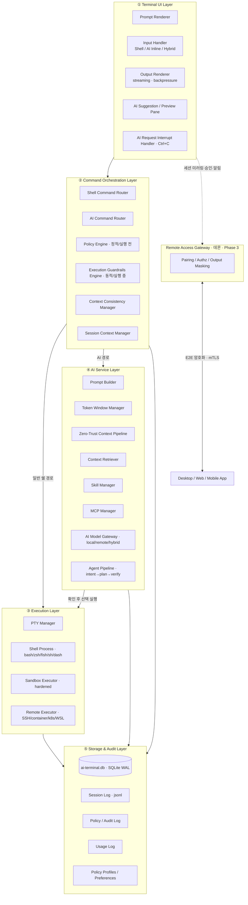
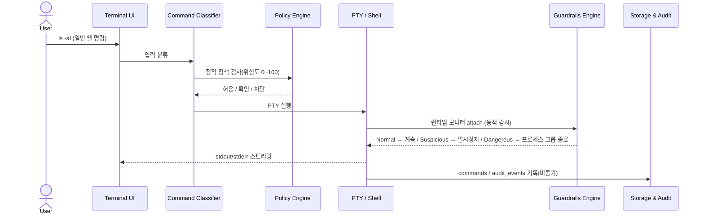
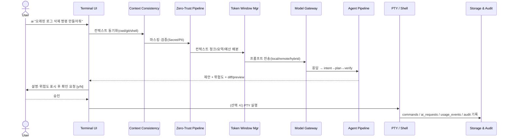

# 03. 프로젝트 아키텍처 정의서

> **프로젝트명**: AI CLI 통합 리눅스 터미널
> **버전**: v1.0
> **작성일**: 2026-06-01
> **기술 스택**: Rust · ratatui · tokio · portable-pty · SQLite (대안: Go)

---

## 1. 아키텍처 개요

### 1.1 아키텍처 스타일

본 시스템은 **로컬 우선 단일 바이너리 CLI/TUI** 아키텍처를 채택한다. 별도의 서버·데몬을 상시 구동하지 않고, 하나의 실행 파일(`ai`) 안에서 일반 리눅스 터미널과 AI 보조 기능을 함께 제공한다.

핵심 철학은 **"AI는 명령 실행자가 아니라 의사결정 보조자"** 이다. 기본 동작은 기존 터미널과 동일하게 유지하고, AI 기능은 명시적 호출·실행 전 설명·위험도 분석·사용자 확인을 중심으로 제공한다(설계 v3.3).

| 특성 | 내용 |
|---|---|
| 배포 형태 | 단일 바이너리(데몬 없음). 다중 프로세스 일관성은 SQLite WAL + 파일 락으로 직렬화 |
| 실행 환경 | Linux / WSL / macOS |
| 동작 우선순위 | 로컬 우선(local-first), 오프라인/제한 네트워크에서도 기본 기능 유지 |
| 경로 분리 | **일반 쉘 경로와 AI 경로를 완전 분리** — AI 장애가 터미널 장애로 전파되지 않음 |
| 셸 통합 | Hook 기반 기본 + Native Wrapper fallback, rc 수정은 명시적 opt-in |

> 가장 중요한 구조적 결정은 **두 실행 경로의 완전 분리**다. 일반 명령은 AI 계층을 전혀 거치지 않아 입력 지연이 최소(목표 10ms 이하)이며, AI 서비스가 죽거나 네트워크가 끊겨도 터미널은 정상 동작한다. `→ 04-config-ops-testing.md §20.1`, `→ 00-overview-architecture.md §3 (원칙 1·3) 참조`.

### 1.2 핵심 패턴

| 패턴 | 설명 | 근거 |
|---|---|---|
| Zero-Trust Pipeline | 모든 외부 컨텍스트(파일·로그·MCP 결과·스킬 콘텐츠)는 신뢰할 수 없는 데이터로 취급하고, 원격 AI 호출 전 Secret/PII 마스킹·검증을 강제 | §6.4.1, §19.5, 원칙 6·7 |
| 정적 Policy + 동적 Guardrails 이중화 | 실행 전 정적 정책 검사(Policy Engine)와 실행 중 동적 감시(Guardrails Engine)를 분리해 방어 깊이 확보 | §8, 원칙 14 |
| Progressive Disclosure | 스킬·MCP·provider 능력을 한 번에 노출하지 않고 매칭·게이팅을 통해 점진적으로 주입·확장 | §5 AI Service, §26 |
| Data Minimization | 원격 AI 호출 전 필요한 최소 정보만 전송 | 원칙 8 |
| Local-policy-wins | 위험도 판단·정책 평가는 항상 로컬에서 먼저 수행, AI 판단은 보조 신호 | 원칙 9, §31.4 |

---

## 2. 시스템 구성도

`00-overview-architecture.md §5`의 5계층 + Remote Access Gateway 구조를 Mermaid로 재현한다.

> Remote Access Gateway는 5계층을 **가로지르는 별도 게이트웨이**다. 호스트의 데몬이 세션 출력 미러링·확인 승인·알림을 클라이언트와 E2E 암호화 채널로 중계한다(Phase 3). `→ 00-overview-architecture.md §5`, `→ 04-config-ops-testing.md §13 [remote] 참조`.

---

## 3. 레이어 구조

각 계층의 책임과 규칙이다.

### 3.1 ① Terminal UI Layer

- **책임**: 키 입력 처리·자동완성·프롬프트 표시, stdout/stderr 렌더링, AI 추천 표시, 실행 전 확인 UI, 스트리밍 제안, Ctrl+C 인터럽트.
- **규칙**:
  - AI 요청은 쉘 명령 실행과 분리된 **취소 가능한 비동기 작업 단위**. Ctrl+C는 AI 요청만 취소하고 쉘은 유지한다.
  - 스트리밍 중인 명령어는 완성 전까지 실행 불가.
  - UI 모드: Shell / AI Inline(`ai "..."`) / AI Dedicated(`ai shell`) / Hybrid(`!cmd`·`/cmd` 혼합).
- `→ 01-core-design.md §6.1 참조`.

### 3.2 ② Command Orchestration Layer

- **책임**: 입력 분류 후 적절한 실행 경로로 라우팅. 정적 정책 검사·동적 가드레일·컨텍스트 일관성 관리.
- **규칙**:
  - 입력을 일반 쉘/AI/내부/위험/자동화 명령으로 분류한다.
  - **Policy Engine(정적)**: 실행 전 위험도 분류·정책 평가. 로컬 정책이 AI 판단보다 항상 우선.
  - **Execution Guardrails Engine(동적)**: 실행 중 비정상 행위(대량 삭제·시스템 경로 접근·Docker socket 접근 등) 감시 후 일시정지·차단.
  - **Context Consistency Manager**: PTY/셸 실제 상태와 AI 컨텍스트 불일치 감지 시 refresh 제안.
- `→ 01-core-design.md §6.2 · §7 · §8 참조`.

### 3.3 ③ Execution Layer

- **책임**: 실제 명령 실행. PTY 생성·입출력 연결, 셸 프로세스, 샌드박스 사전 실행, 원격 실행.
- **규칙**:
  - 지원 셸: bash/zsh(MVP), fish/sh/dash(이후).
  - 샌드박스는 **보조 안전장치이지 완전한 보안 경계가 아니다**(원칙 13). root 실행 금지·cap_drop ALL·no-new-privileges·network none·read-only rootfs·자원 제한 적용.
  - 샌드박스 실행 실패 시 실제 실행으로 **자동 전환하지 않는다**.
  - Remote Executor: SSH/container exec/k8s exec/WSL/Dev Container. 컨텍스트 스택으로 로컬/원격 구분.
- `→ 01-core-design.md §6.3 참조`.

### 3.4 ④ AI Service Layer

- **책임**: 자연어 요청을 명령어·설명·분석으로 변환. 컨텍스트 정제·토큰 예산·Zero-Trust·검색·스킬/MCP·모델 게이트웨이·에이전트 파이프라인.
- **규칙**:
  - Token Window Manager: 대용량 로그·히스토리를 청크/요약/예산 배분 후 전달(기본 8,000~16,000 tokens, overlap 5~10%).
  - Zero-Trust Pipeline: Raw Context → Secret 탐지 → PII 탐지 → Masking → Validation Scan → Remote AI Eligibility Check.
  - Agent Pipeline(Phase 2): intent→plan→parallel tool→retrieve→generate→verify→format. Verification Agent가 생성 명령을 재검토.
  - MCP 도구 호출·스킬 스크립트는 일반 명령과 동일한 위험도 분류·확인·감사를 받는다(원칙 19).
- `→ 01-core-design.md §6.4 참조`.

### 3.5 ⑤ Storage & Audit Layer

- **책임**: 세션·명령·AI 요청·사용량·감사·컨텍스트 스냅샷·락을 영속화.
- **규칙**:
  - 단일 `ai-terminal.db`(SQLite WAL) 7테이블 + 파일 락/stale lock. 스키마 정본은 ERD 문서.
  - 세션 로그(jsonl), undo 백업은 파일 기반 비-DB 저장소.
  - 감사 로그는 추적성을 높이되 민감 정보는 저장하지 않는다. 마스킹된 값만 저장(원칙 16).
- `→ 02_ERD_문서.md`, `→ 04-config-ops-testing.md §15 참조`.

---

## 4. 핵심 데이터 흐름

`00-overview-architecture.md §5`가 정의한 두 경로를 시퀀스로 표현한다.

### 4.1 일반 쉘 경로 (AI 계층 미경유 — 저지연)

- 핵심: `Input → Classifier → Policy Engine → PTY 실행 → (Guardrails 동적 감시) → Output`. AI 계층을 거치지 않아 지연 최소.

### 4.2 AI 경로 (Zero-Trust 통과 — 확인 후 실행)

- 핵심: `Input → Classifier → Context Consistency 동기화 → Zero-Trust Pipeline → (Skill 매칭/주입) → Token Window Manager → Model Gateway → Agent Pipeline → (MCP 도구 호출 게이트) → 제안/설명/preview → 사용자 확인 → (선택 시) PTY 실행`.
- AI 생성 명령은 기본적으로 자동 실행하지 않는다(원칙 11).

---

## 5. 핵심 설계 결정 (ADR 스타일)

### ADR-1. Hook 기반 셸 통합 + Native Wrapper fallback

- **결정**: 셸 통합은 preexec/precmd Hook을 기본으로 하고 Native Wrapper를 fallback으로 둔다. rc 파일 수정은 명시적 opt-in이며 dry-run/diff/uninstall을 필수 제공한다.
- **이유**: Hook은 빠르게 시작 가능하고, `cd`·`export`·`git branch` 상태를 AI 컨텍스트에 자연스럽게 동기화한다. Hook 실패가 일반 셸 사용을 중단시키지 않는다.
- **대안**: Wrapper 기본(v3.0 잠정안) — 도입 비용이 크고 호환성 부담.
- **트레이드오프**: Hook은 셸별(bash/zsh) 구현이 필요하고 rc 삽입을 동반하지만, 무해성(미설치 시 무평가)·`--uninstall`로 위험을 통제한다.
- `→ 06-mvp-implementation-spec.md §31.1 참조`.

### ADR-2. 데몬 없는 단일 바이너리 + SQLite WAL

- **결정**: 상시 데몬을 두지 않고 단일 `ai-terminal.db`(WAL) + advisory 파일 락 + stale lock cleanup으로 다중 프로세스 일관성을 확보한다.
- **이유**: 운영 단순성·설치 편의. 데몬 생명주기·권한·포트 관리 부담 제거. 로컬 우선 철학에 부합.
- **대안**: 중앙 데몬/DB 서버 — 동시성 제어는 쉬워지나 배포·운영 복잡도와 장애 표면이 커진다.
- **트레이드오프**: 다중 터미널 동시 쓰기를 직접 직렬화해야 하므로 Lock TTL·stale 판정·heartbeat 메커니즘이 필요하다(`locks` 테이블 + `locks/` 파일 2층).
- `→ 06-mvp-implementation-spec.md §31.2`, `→ 02_ERD_문서.md` 섹션 3 참조.

### ADR-3. 구현 언어로 Rust 채택 (대안 Go)

- **결정**: Rust + ratatui + crossterm + tokio + portable-pty 조합을 1순위로 채택한다.
- **이유**: PTY·보안·성능 비중이 크고, 메모리 안전성과 단일 바이너리 배포가 중요.
- **대안**: Go + bubbletea + lipgloss + cobra — 운영자 친화적 단일 바이너리 배포가 더 중요할 때 선택.
- **트레이드오프**: Rust는 개발 난이도·컴파일 시간이 높으나 런타임 안전성·성능을 얻는다. Go는 배포·생산성이 좋으나 저수준 제어가 약하다.
- `→ 04-config-ops-testing.md §24 참조`.

### ADR-4. 위험도 0~100 deterministic 스코어링 (AI는 보조 신호)

- **결정**: rule-based 0~100 점수 스코어링을 MVP 정본으로 한다. AI 판단은 보조 신호이며 로컬 정책이 항상 우선한다.
- **이유**: 동일 명령·환경은 동일 점수여야 재현성·검수·감사가 성립한다. AI 비결정성에 안전 판단을 의존하지 않는다.
- **대안**: AI 분류 기반 위험도 — 비결정적이고 프롬프트 인젝션에 취약.
- **트레이드오프**: 룰셋 유지보수가 필요하고 신종 위험 패턴 반영이 지연될 수 있으나, Critical(80~100)은 항상 차단되어 안전 하한이 보장된다.
- 등급: Low 0~24 / Medium 25~49 / High 50~79 / Critical 80~100. `→ 06-mvp-implementation-spec.md §31.4 참조`.

### ADR-5. 샌드박스는 보조 안전장치(완전한 보안 경계 아님)

- **결정**: 샌드박스(tmpdir/container→bubblewrap/gVisor/Firecracker)는 보조 안전장치로 취급한다. 샌드박스 실행 성공이 호스트 안전을 보장하지 않으며, 샌드박스 실패 시 실제 실행으로 자동 전환하지 않는다.
- **이유**: 컨테이너 탈출·side effect 가능성을 전제로 최소 권한·다층 방어를 설계한다(원칙 13).
- **대안**: 샌드박스를 신뢰 경계로 가정 — 우회 시 치명적.
- **트레이드오프**: 사용자에게 한계를 명시 고지하고 추가 확인을 요구하므로 마찰이 늘지만, 안전 오판을 방지한다. MVP는 tmpdir+container 제한 실행, 보안 강화 버전에서 gVisor/Firecracker.
- `→ 01-core-design.md §6.3`, `→ 04-config-ops-testing.md §24.3 참조`.

---

## 6. 외부 연동

| 연동 대상 | 방식 | 정책 / 보안 | Phase |
|---|---|---|---|
| AI Provider (원격) | Provider capability map 기반 minimal interface. streaming/token/usage/JSON 미지원 시 명시적 fallback | Zero-Trust 마스킹 통과 후 호출, 예산 초과 시 차단, masking 실패 시 차단 | MVP+ |
| 로컬 LLM (Ollama) | `[local_llm]` 설정으로 CPU/GPU/메모리/큐 제한, 백그라운드 인덱싱 저우선 | 민감 정보 외부 미전송·오프라인. 비용 0 또는 local resource usage 표시 | Phase 2 |
| MCP 서버 | 여러 MCP 서버의 도구/리소스/프롬프트를 중앙 등록·집계·라우팅(`mcp.json`) | 도구 호출=액션 → 위험도 분류·컨센트·감사. mutate/external 도구는 동의 필요, 결과는 인젝션 스캔 | Phase 2+ |
| Remote (앱/웹/모바일) | Remote Access Gateway 데몬이 세션 미러링·승인·알림 중계 | 디바이스 페어링·최소 권한·E2E·mTLS. Critical 원격 승인 기본 금지 | Phase 3 |
| 검색/인덱스 | ripgrep + SQLite FTS(MVP) → tantivy / sqlite-vss / LanceDB(고도화) | 백그라운드 인덱싱은 응답성 저해 금지(원칙 15) | MVP→Phase 2 |

> Provider 차이는 숨기지 않고 capability map으로 관리한다(완전 추상화는 비목표). `→ 06-mvp-implementation-spec.md §31.9`, `→ 04-config-ops-testing.md §21 · §13 참조`.

### 6.1 멀티 프로바이더 라우팅

`[ai.routing]` 설정으로 `local_first`(기본)/`remote_first`/`cost_aware`/`quality_aware` 전략을 둔다. 민감 컨텍스트는 강제로 로컬 처리(`sensitive_context_forces_local = true`). Provider Error 시 허용 범위 내에서 secondary provider로 폴백한다. `→ 04-config-ops-testing.md §13 [ai.routing] · §16.2 참조`.

---

## 부록. 상호 참조

- 전체 아키텍처 5계층·Remote Gateway 원문: `→ 00-overview-architecture.md §5`
- 핵심 설계 원칙 20개: `→ 00-overview-architecture.md §3`
- 컴포넌트 상세·Context Consistency·Guardrails: `→ 01-core-design.md §6 · §7 · §8`
- 저장 구조·기술 스택·샌드박스 선택 기준: `→ 04-config-ops-testing.md §15 · §24`
- MVP 확정 명세(셸/스토리지/정책/위험도/provider): `→ 06-mvp-implementation-spec.md §31`
- DB 스키마 정본: `→ 02_ERD_문서.md`
