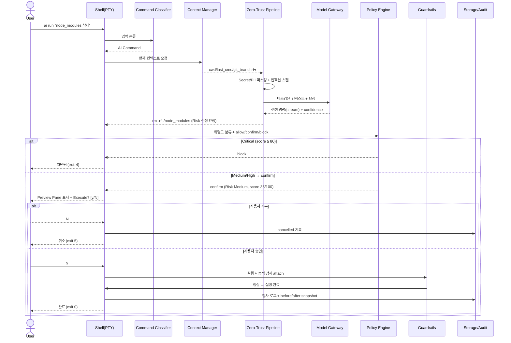
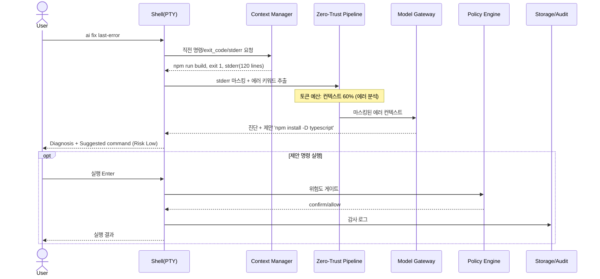
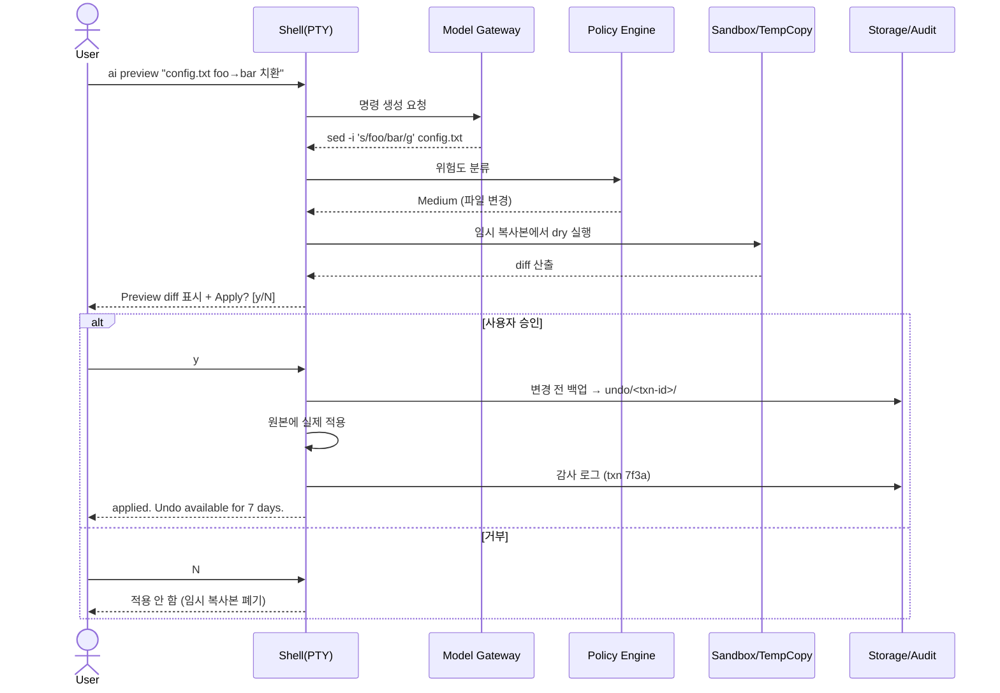
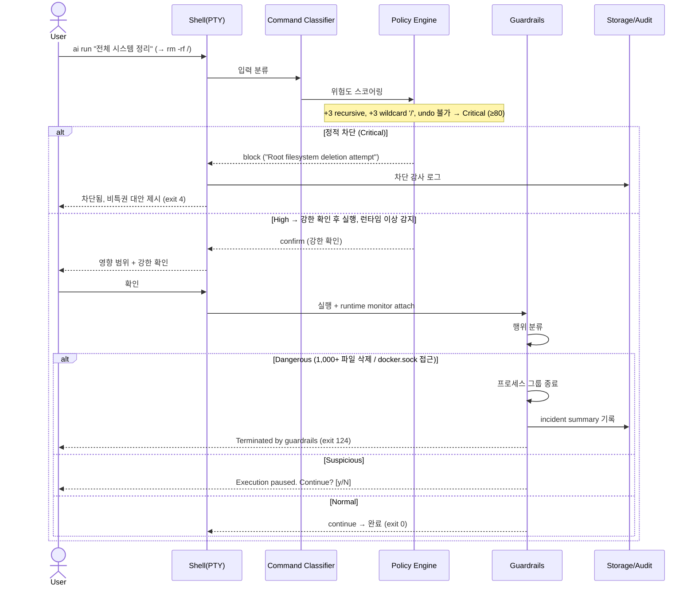
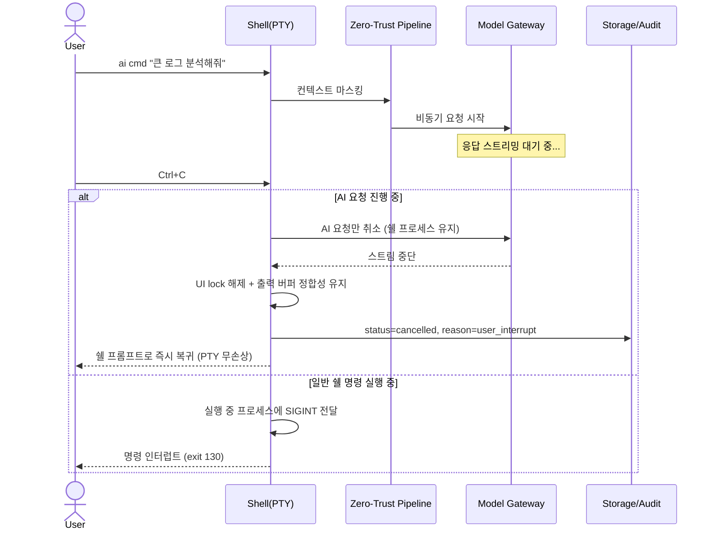
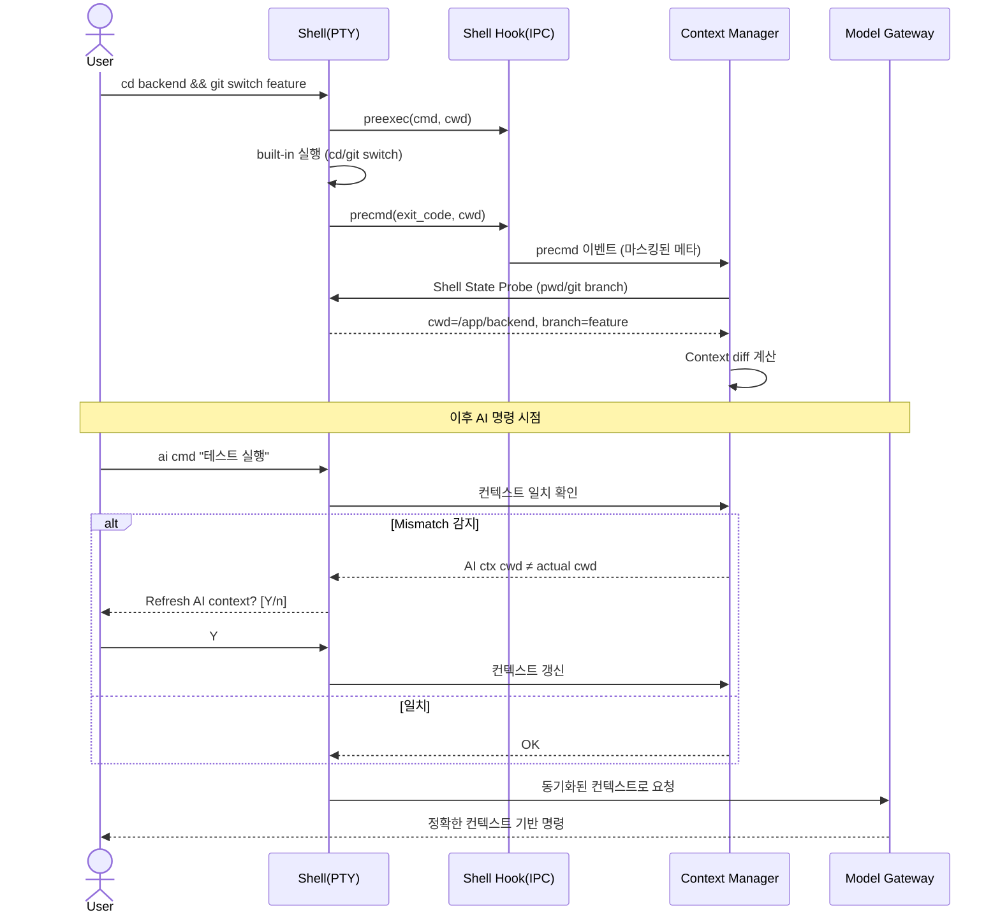
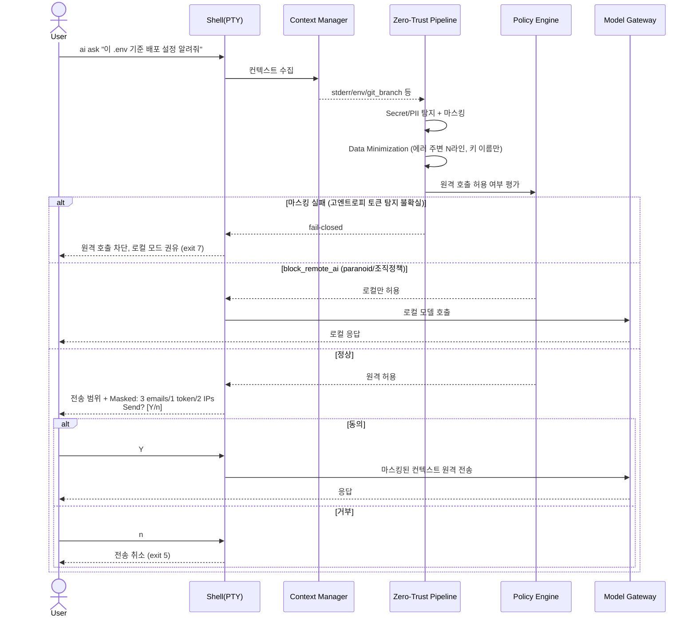
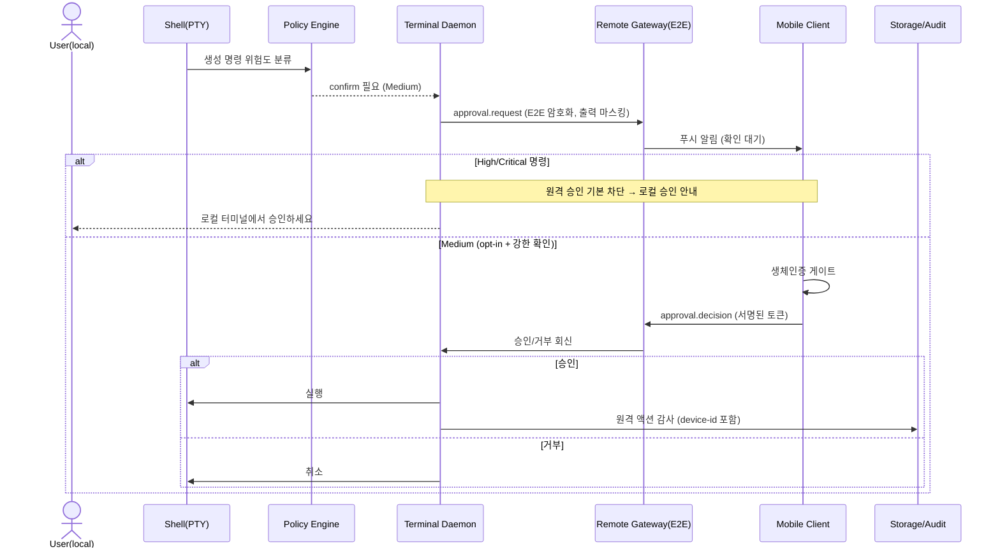
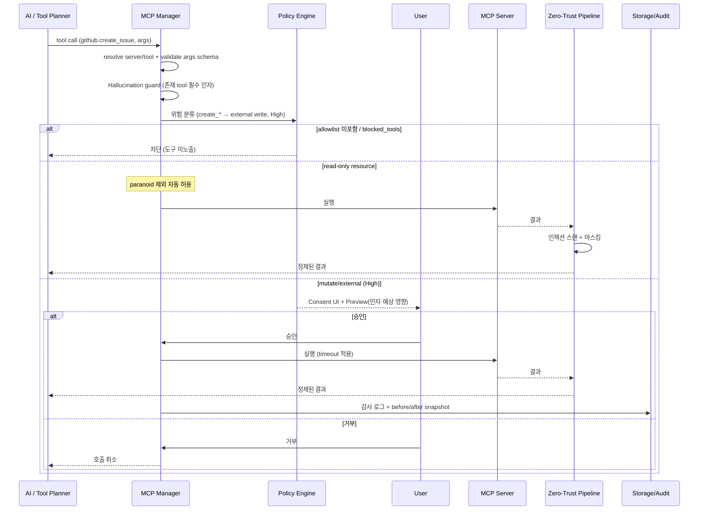

# 05. 화면 흐름 시퀀스 다이어그램
> **프로젝트명**: AI CLI 통합 리눅스 터미널
> **버전**: v1.0
> **작성일**: 2026-06-01
> **기술 스택**: Rust · ratatui · tokio · portable-pty · SQLite (대안: Go)
---

> 핵심 사용자 플로우를 Mermaid `sequenceDiagram`으로 표현한다. 참여자(participant)에는 실제 컴포넌트를 병기한다.
> 명령 인터페이스는 `→ 04_API_명세서.md 참조`, 정책·위험도는 `→ 02-security-policy.md §10·§12 참조`, 컴포넌트 설계는 `→ 01-core-design.md §6~§9 참조`.

## 공통 참여자 (Participant)

| 약칭 | 컴포넌트 | 역할 |
|---|---|---|
| `User` | 사용자 | 명령 입력·확인 |
| `Shell` | Shell(PTY) | PTY Manager + 쉘 프로세스(`→ 01 §6.3`) |
| `Classifier` | Command Classifier | 입력 분류(`→ 01 §6.2`) |
| `ContextMgr` | Context Consistency Manager | 컨텍스트 동기화(`→ 01 §7`) |
| `PolicyEngine` | Policy Engine | 정적 allow/confirm/block(`→ 02 §12`) |
| `ZeroTrust` | Zero-Trust Pipeline | 마스킹·인젝션 스캔·컨센트(`→ 02 §10.3`) |
| `ModelGateway` | Model Gateway / AIProvider | 모델 라우팅·호출(`→ 05 §29.10·§30-5`) |
| `Guardrails` | Execution Guardrails Engine | 실행 중 동적 감시(`→ 01 §8`) |
| `Storage` | Storage & Audit Layer | 히스토리·감사 로그(`→ 01 §6.5`, `→ 02 §10.5`) |

---

## 1. 자연어 → 명령 생성 후 확인 실행 (`ai cmd` / `ai run`)

가장 기본적인 플로우. 자연어 요청을 마스킹·정책 게이트를 거쳐 명령으로 변환하고, 사용자 확인 후 실행한다.

**분기/예외**:
- `ai cmd`는 동일 흐름이되 생성·표시까지만 수행하고 실행 게이트를 적용하지 않는다(`→ 04 §2.1`).
- confidence가 낮으면 Risk와 별개로 "확신 낮음" 배지 + 강한 확인을 추가한다(`→ 05 §29.3`).
- `sudo` 포함 + `allow_sudo_ai_commands=false`면 제안만 하고 `ai run` 직접 실행은 막는다(`→ 05 §29.12`).

---

## 2. 에러 분석 (`ai fix last-error`)

직전 실패 명령의 종료 코드·stderr를 수집해 원인을 분석하고 수정 명령을 제안한다.

**분기/예외**:
- 직전 명령이 없거나 exit 0이면 분석 대상 없음을 안내한다.
- 분석(read)은 자동 수행하되 수정 명령 실행은 별도 정책 게이트를 거친다(`→ 04 §2.1`).
- stderr가 대용량이면 마지막 부분·에러 키워드 중심으로 슬라이딩 윈도우 요약한다(`→ 01 §6.4.1`).

---

## 3. 파일 변경 preview/diff 적용 (`ai preview`)

파일 변경 명령을 실제 적용 전 임시 복사본/dry-run으로 diff를 산출해 보여주고, 승인 시 적용하며 undo 백업을 남긴다.

**분기/예외**:
- 명령 자체가 dry-run을 지원하면(rsync `--dry-run`, terraform `plan` 등) 그것을 우선 사용한다(`→ 01 §9.4`).
- 백업 상한(500MB/1,000 files/파일 20MB) 초과 시 undo 미지원을 사전 고지한다(`→ 05 §30-6`).
- `ai undo`로 복구하면 백업에서 파일을 원복한다.

---

## 4. 위험 명령 차단 / 강한 확인 (`rm -rf /`)

정적 Policy Engine과 동적 Guardrails가 2중으로 위험을 차단한다.

**분기/예외**:
- `paranoid` 프로파일은 모든 AI 명령에 확인을 요구하고 Critical은 무조건 차단한다(`→ 02 §12.2`).
- Guardrails capability는 플랫폼 편차가 있다: baseline(timeout·프로세스 그룹 종료·삭제 수 사전 계산)은 전 플랫폼, cgroups/fanotify/seccomp/eBPF는 Linux 우선(`→ 05 §30-8`).
- AI는 destructive 명령보다 dry-run 대안을 먼저 제안해야 한다(`→ 01 §9.4`).

---

## 5. Ctrl+C — AI 요청 취소 및 Graceful Recovery

AI 요청은 쉘 프로세스 인터럽트와 분리된 취소 가능한 비동기 작업 단위다(`→ 01 §6.1`, MVP+ 필수 `→ 05 §25.1-4`).

**분기/예외**:
- 네트워크 장애·응답 지연·타임아웃에도 터미널은 프리징되지 않는다. 타임아웃 시 exit 8(`→ 04 §1.4`).
- 스트리밍 중 취소해도 출력 버퍼가 깨지지 않아야 한다.
- 스트리밍 중인 명령은 완성 전까지 실행할 수 없다(`→ 01 §6.1`).

---

## 6. 컨텍스트 동기화 (cd / git switch 후 mismatch refresh)

built-in 명령으로 쉘 상태가 바뀌면 Hook IPC가 이를 push하고, Context Manager가 불일치를 감지해 갱신한다(`→ 05 §29.1`, `→ 01 §7`).

**분기/예외**:
- Hook 미설치/비호환 시 Native Wrapper가 명령 실행 후 polling probe로 동기화한다(`→ 05 §30-1`).
- `env`/`set` 출력에는 민감 정보가 포함될 수 있어 probe 결과도 마스킹 후 사용한다(`→ 01 §7.4`).
- 세션별 `session_id`로 격리해 한 탭의 `cd`가 다른 탭에 새지 않는다(`→ 05 §29.9`).
- 실행 위치가 바뀌면 Context Stack에 push하고 프롬프트에 `[ssh:host:cwd]$` 형태로 표시한다(`→ 01 §7.5`).

---

## 7. 원격 마스킹 · 컨센트 후 호출 (Zero-Trust)

원격 AI 호출 전 마스킹 결과와 전송 범위를 사용자에게 명시하고 동의를 받는다(`→ 02 §10.3·§10.4`).

**분기/예외**:
- `paranoid`는 전송 범위 확인을 항상 요구한다(`→ 02 §10.3`). `balanced`는 민감 시에만(`when_sensitive`).
- 민감 컨텍스트 감지 시 라우팅이 무조건 로컬로 강제된다(`sensitive_context_forces_local`, `→ 05 §29.10`).
- `.env`·private key·credential 파일은 사용자 명시 허용 없이는 컨텍스트에 포함하지 않는다(`→ 02 §10.4`).

---

## 8. (Phase 3) 원격 승인 푸시 / (Phase 2) MCP 도구 게이트

### 8.1 원격 승인 푸시 (Phase 3)

외출 중 모바일로 AI 확인 프롬프트를 받아 승인/거부한다. High/Critical은 원격 승인 기본 차단(`→ 03 §28.4`, `→ 05 §30-13`).

**분기/예외**:
- 디바이스 기본 권한은 `read_only`이며 `approve`/`full`은 명시적 grant 필요(`→ 04 §2.5.3`).
- 외부 부작용 MCP 도구(결제·배포·삭제)는 원격 승인 대상에서 기본 제외.
- 세션 타임아웃·디바이스 revoke·키 회전으로 폐기 가능.

### 8.2 MCP 도구 게이트 (Phase 2)

AI가 호출하려는 MCP 도구를 일반 명령과 동일하게 게이팅한다(`→ 03 §27.4`).

**분기/예외**:
- 미선언 도구는 write/external로 보수 분류하며, **서버 선언보다 로컬 정책이 우선**(`→ 05 §30-11`).
- 외부 도구 응답에 프롬프트 인젝션이 섞일 수 있어 결과를 데이터로만 취급하고 인젝션 스캔 후 컨텍스트에 넣는다(`→ 03 §27.6`).
- 자격 증명은 keyring 참조로만 보관하고 감사 로그·디버그 번들에서 제외한다.

---

## 상호 참조

- 명령·옵션·종료 코드·내부 인터페이스 → `04_API_명세서.md` 참조
- 위험도·정책 프로파일·마스킹 규칙 → `02-security-policy.md §10·§12` 참조
- 컴포넌트(Context Manager·Guardrails·Agent Pipeline) → `01-core-design.md §6~§9` 참조
- 셸 통합·undo·라우팅·결정안 → `05-roadmap-enhancements-decisions.md §29·§30` 참조
- 스킬/MCP/리모트 → `03-subsystems-skill-mcp-remote.md §26~§28` 참조
