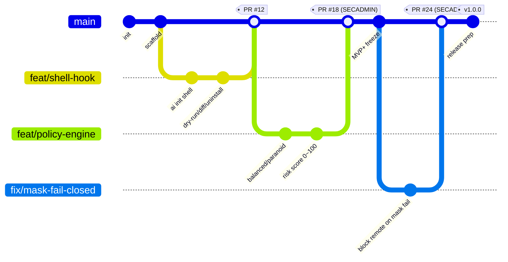

# 09. Git 규칙 정의서
> **프로젝트명**: AI CLI 통합 리눅스 터미널
> **버전**: v1.0
> **작성일**: 2026-06-01
> **기술 스택**: Rust · ratatui · tokio · portable-pty · SQLite (대안: Go)
---

본 문서는 "AI CLI 통합 리눅스 터미널"(설계 v3.3) 저장소의 브랜치 전략, 커밋 규칙, PR 규칙, 릴리즈/태깅 규칙을 정의한다. 본 도구는 **터미널을 감싸고 명령을 실행하는 도구이자 공격 표면**이므로(§29.11), Git 워크플로 자체에 보안 게이트를 내장한다.

> 상호참조: 코드 리뷰 절차는 `→ 12_코드_리뷰_규칙.md 참조`, 플러그인 인터페이스/권한 경계는 `→ 14 플러그인 구조(docs/04-config-ops-testing.md §14) 참조`.

---

## 1. 브랜치 전략

### 1.1 모델 — GitHub Flow

본 프로젝트는 단일 바이너리 배포 + Phase별 릴리스 태깅 구조이므로, 장수(long-lived) 브랜치를 최소화하는 **GitHub Flow**를 채택한다.

- **`main`**: 항상 배포 가능한 상태. 직접 push 금지(branch protection). 모든 변경은 PR로만 머지.
- **단기 작업 브랜치**: `feat/`·`fix/`·`docs/`·`refactor/`·`test/`·`chore/`. `main`에서 분기, 머지 후 삭제.
- **릴리스 태깅**: Phase 1(MVP+)/2/3/4 마일스톤마다 SemVer 태그(`v1.0.0` 등). 별도 `release/*` 브랜치는 핫픽스 백포트가 필요한 Phase 3(Team & Enterprise) 이후에만 한정 도입.

> Git Flow(develop + release + hotfix 다중 장수 브랜치)는 MVP 단계의 단일 배포 채널에는 과하므로 채택하지 않는다.

### 1.2 브랜치 흐름 (Mermaid gitgraph)



### 1.3 브랜치 네이밍 규칙

형식: `<type>/<이슈번호>-<짧은-설명-kebab-case>`

| 접두어 | 용도 | 예시 |
|---|---|---|
| `feat/` | 신규 기능 | `feat/142-shell-hook-install` |
| `fix/` | 버그 수정 | `fix/151-mask-fail-closed` |
| `docs/` | 문서만 변경 | `docs/160-config-reference` |
| `refactor/` | 동작 변화 없는 구조 개선 | `refactor/170-provider-capability-map` |
| `test/` | 테스트 추가·보강 | `test/175-golden-dangerous-commands` |
| `chore/` | 빌드·의존성·CI 등 | `chore/180-bump-tokio` |

- 이슈번호는 가능한 한 항상 포함(추적성). 이슈가 없으면 `feat/no-issue-...`는 지양하고 먼저 이슈를 생성한다.
- 설명은 영문 kebab-case, 50자 이내.
- **보안 민감 변경**(마스킹·정책 엔진·위험도 스코어링·샌드박스·서명/업데이트)은 접두어와 무관하게 PR에서 `security` 라벨을 부착한다(§3.3).

---

## 2. 커밋 메시지 규칙

### 2.1 Conventional Commits

형식:

```text
<type>(<scope>): <subject>

<body>

<footer>
```

- `subject`: 명령형, 72자 이내, 마침표 없음. 한국어/영어 혼용 허용하되 한 줄에 하나의 언어.
- `body`: "왜" 중심으로 변경 동기와 영향 기술. 보안 관련 변경은 **위협/완화**를 한 줄 이상 명시.
- `footer`: 이슈 연결(`Closes #142`), Breaking Change 고지.

### 2.2 type 목록

| type | 의미 | SemVer 영향 |
|---|---|---|
| `feat` | 신규 기능 | minor |
| `fix` | 버그 수정 | patch |
| `docs` | 문서 변경 | 없음 |
| `refactor` | 동작 불변 구조 개선 | 없음 |
| `perf` | 성능 개선 | patch |
| `test` | 테스트 추가·수정 | 없음 |
| `build` | 빌드 시스템·의존성 | 없음 |
| `ci` | CI/CD 설정(GitHub Actions) | 없음 |
| `chore` | 기타 잡무 | 없음 |
| `security` | 보안 수정·강화 | patch 또는 그 이상 |
| `revert` | 이전 커밋 되돌림 | 상황별 |

> Breaking Change는 `feat!:` / `fix!:` 또는 footer `BREAKING CHANGE:`로 표기하며 major 증가 사유가 된다.

### 2.3 scope 예시 (본 프로젝트 도메인)

| scope | 영역 | 근거 |
|---|---|---|
| `shell` | 셸 통합·Hook·rc 삽입 블록 | §29.1, §31.1 |
| `ai` | AI 요청·라우팅·타임아웃·캐싱 | §13 `[ai]`, §29.10 |
| `policy` | 정책 엔진·프로파일(balanced/paranoid)·위험도 스코어링 | §12, §31.3·§31.4 |
| `mask` | Secret/PII 마스킹 파이프라인 | §10.4, §31.8 |
| `guard` | Guardrails·hallucination guard·preview/diff | §29.2, §31.5·§31.11 |
| `store` | SQLite(WAL)·락·세션/감사 로그 | §15, §31.2 |
| `skill` | 통합 스킬 관리(Phase 2) | §26 |
| `mcp` | MCP 연동(Phase 2 이후) | §27 |
| `remote` | 원격 모니터링·승인(Phase 3) | §28 |

예시:

```text
feat(shell): ai init shell에 --dry-run/--diff/--uninstall 추가

Hook 기반 통합을 기본값으로 하되 rc 파일은 자동 수정하지 않는다(§29.1, §31.1).
삽입 블록은 'command -v ai' 가드로 감싸 미설치 환경에서도 무해하다.

Closes #142
```

```text
security(mask): private key 블록 감지 시 원격 AI 호출 fail-closed

정규식이 못 잡는 고엔트로피 토큰까지 휴리스틱으로 보완하고, 탐지 불확실 시
원격 전송을 차단한다(§29.8, §31.8). 위협: 마스킹 우회를 통한 시크릿 유출.

Closes #151
```

---

## 3. PR 규칙

### 3.1 PR 제목

브랜치의 대표 커밋과 동일한 Conventional Commits 형식을 따른다.

```text
feat(policy): balanced/paranoid 프로파일 및 위험도 0~100 스코어링
```

### 3.2 PR 본문 템플릿

```markdown
## 무엇을 / 왜
- 변경 요약과 동기 (설계 §섹션 인용)

## 변경 사항
- [ ] 주요 변경 1
- [ ] 주요 변경 2

## 설계 근거 / 상호참조
- docs/06-mvp-implementation-spec.md §31.x
- → 12_코드_리뷰_규칙.md 참조

## 테스트
- [ ] 단위 테스트 추가/통과 (파서·위험도 분류기·마스킹 등)
- [ ] Golden Set 회귀(해당 시, §22.6)
- [ ] 수용 기준 충족(§31.x acceptance criteria 인용)

## 보안 체크 (보안 민감 변경 필수)
- [ ] 마스킹 우회 경로 없음
- [ ] 정책 엔진/Zero-Trust 파이프라인 우회 불가
- [ ] AI 생성 명령 자동 실행 없음
- [ ] 시크릿이 로그/컨텍스트/캐시에 미포함
- [ ] 위험도 점수 deterministic

## 스크린샷/로그 (선택)
```

### 3.3 리뷰어 지정 및 Merge 조건

| 변경 유형 | 필수 리뷰어 | Merge 조건 |
|---|---|---|
| 일반 변경 | 코드 오너 1명 | CI 통과 + 1 Approve |
| 보안 민감 변경(`security` 라벨) | 코드 오너 1명 + **SECADMIN 1명** | CI 통과 + 2 Approve(SECADMIN 승인 필수) |
| 릴리스 PR | Maintainer | CI 통과 + Maintainer Approve + 태깅 검증 |

보안 민감 변경 범위(SECADMIN 승인 강제): 마스킹(`mask`), 정책 엔진/프로파일(`policy`), 위험도 스코어링, Guardrails/preview(`guard`), 샌드박스 설정, 서명·자동 업데이트(§29.11), 플러그인 권한 경계(§14), 원격 승인(`remote`).

공통 Merge 게이트:

- `main` 직접 push 금지(branch protection).
- 필수 CI(`fmt`/`clippy -D warnings`/`test`/`audit`/golden 회귀)가 모두 통과.
- 미해결 리뷰 코멘트 0건.
- 머지 전략은 **Squash merge**(선형 히스토리, 1 PR = 1 logical commit). 머지 후 작업 브랜치 삭제.
- `unsafe` Rust 블록을 추가/변경하는 PR은 SECADMIN 검토를 강제한다(`→ 12_코드_리뷰_규칙.md 참조`).

---

## 4. 릴리즈 / 태깅 규칙

### 4.1 SemVer

`MAJOR.MINOR.PATCH` 형식을 따른다.

| 증가 | 사유 | 예 |
|---|---|---|
| MAJOR | Breaking Change(설정 스키마 호환 파괴, CLI 인터페이스 변경) | `1.0.0 → 2.0.0` |
| MINOR | 하위 호환 기능 추가(`feat`) | `1.0.0 → 1.1.0` |
| PATCH | 버그/보안 수정(`fix`,`security`,`perf`) | `1.0.0 → 1.0.1` |

Phase ↔ 버전 가이드: Phase 1(MVP+) = `v1.x`, Phase 2(Intelligent Workflow) = `v2.x`, Phase 3(Team & Enterprise) = `v3.x`, Phase 4(Advanced Automation) = `v4.x`. (실제 major 승급은 Breaking 여부로 결정)

### 4.2 태깅 절차

```bash
# 1. main 최신화 및 CI green 확인 후
git tag -s v1.0.0 -m "AI Terminal v1.0.0 (MVP+)"
git push origin v1.0.0
```

- 태그는 **서명 태그(`-s`)** 를 사용한다.
- 태그 push 시 GitHub Actions가 릴리스 파이프라인을 트리거한다.

### 4.3 서명 바이너리 + 공급망 보안 (§29.11)

- 릴리스 산출물은 **서명된 단일 바이너리 + 체크섬**으로 배포한다.
- 자동 업데이트는 `auto_update = "notify"`(기본)이며 **서명 검증 후에만** 적용한다(`verify_signature = true`).
- **다운그레이드 공격 방지**: 버전 단조 증가(monotonic)를 강제한다(`allow_downgrade = false`). 릴리스 워크플로는 직전 태그보다 낮은 SemVer 태그를 거부한다.
- 셸 hook 스니펫(§31.1) 및 플러그인 manifest는 서명된 형태로만 배포·주입한다.

```toml
# 배포 정책(참조: config.toml §13, §29.11)
[update]
auto_update = "notify"        # off | notify | auto
verify_signature = true
allow_downgrade = false
```

### 4.4 CHANGELOG & 릴리스 체크리스트

- CHANGELOG는 Conventional Commits 기반 자동 생성. `security` 커밋은 별도 "Security" 섹션으로 강조하고 영향 범위·권고 조치(즉시 업데이트 등)를 명시한다.
- 릴리스 게이트: 필수 CI 전부 통과 / 보안 민감 변경 SECADMIN 승인 이력 확인 / SemVer 단조 증가 / 서명 태그 push / 서명 바이너리 + 체크섬 검증 / `→ 12_코드_리뷰_규칙.md` 보안 체크리스트 전 항목 통과.
