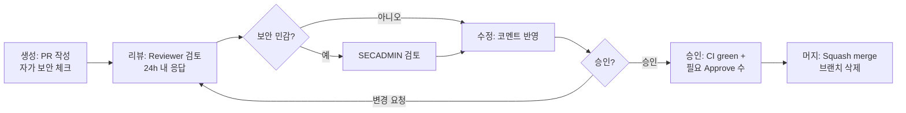

# 12. 코드 리뷰 규칙
> **프로젝트명**: AI CLI 통합 리눅스 터미널
> **버전**: v1.0
> **작성일**: 2026-06-01
> **기술 스택**: Rust · ratatui · tokio · portable-pty · SQLite (대안: Go)
---

본 문서는 "AI CLI 통합 리눅스 터미널"(설계 v3.3)의 코드 리뷰 절차와 체크리스트를 정의한다. 본 도구는 **명령을 실행하고 컨텍스트를 외부 AI로 전송**하므로, 일반 리뷰 항목에 더해 **프로젝트 특화 보안 체크**를 게이트로 둔다.

> 상호참조: 테스트 전략은 `→ 11_테스트_전략서.md 참조`, 브랜치/PR/Merge 게이트는 `→ 09_Git_규칙_정의서.md 참조`.

---

## 1. 역할과 책임

| 역할 | 책임 |
|---|---|
| **Author** | PR 작성. 설계 §섹션 인용, 테스트·수용 기준 충족, 보안 체크리스트 자가 점검 후 리뷰 요청. |
| **Reviewer** | 기능·가독성·성능·테스트 검토. 보안 우려 발견 시 SECADMIN 소환. 24시간 내 1차 응답. |
| **Maintainer** | Merge 권한 보유. Merge 게이트(CI·승인 수·미해결 코멘트 0) 최종 확인, 릴리스 태깅. |
| **SECADMIN** | 보안 민감 변경 승인 권한 보유. 마스킹·정책·위험도·샌드박스·서명/업데이트·`unsafe` 검토. 거부권 행사 가능. |

> 역할 체계는 SHARED CONTRACT의 DEV/OPS/RESEARCH/SECADMIN 역할과 정렬한다. 보안 민감 변경의 SECADMIN 승인은 필수(`→ 09_Git_규칙_정의서.md §3.3 참조`).

---

## 2. 리뷰 프로세스

1. **생성**: Author가 PR 본문 템플릿을 채우고, 보안 민감 변경이면 `security` 라벨과 SECADMIN을 지정한다.
2. **리뷰**: Reviewer가 24시간 내 1차 응답. 일반 체크리스트 + 보안 체크리스트 적용.
3. **수정**: Author가 코멘트를 반영하고 재요청. 토론은 코멘트 스레드에서 마무리(resolve).
4. **승인**: CI 통과 + 필요한 Approve 수 충족(일반 1, 보안 민감 2 — SECADMIN 포함).
5. **머지**: Maintainer가 Squash merge, 작업 브랜치 삭제.

---

## 3. 리뷰 체크리스트

### 3.1 일반

**기능**
- [ ] 요구사항/설계 §섹션과 동작이 일치하는가.
- [ ] 해당 §31.x **수용 기준(acceptance criteria)** 을 충족하는가.
- [ ] 엣지 케이스(빈 입력, 타임아웃, 권한 없음, 비호환 셸)를 처리하는가.
- [ ] 에러 처리: AI 장애가 일반 셸 사용을 막지 않는가(§16.2).

**가독성**
- [ ] 이름·구조가 도메인 용어와 일치(shell/ai/policy/mask/guard/store).
- [ ] 주석은 "왜"를 설명, 죽은 코드/디버그 출력 없음.
- [ ] 함수 책임이 단일하고 과도한 중첩이 없는가.

**성능**
- [ ] 일반 셸 경로와 AI 경로가 분리되어 입력 지연(목표 10ms 이하)을 침해하지 않는가(§20).
- [ ] 컨텍스트 수집·세션 저장이 비동기인가(§20.2).
- [ ] 대량 출력/로그를 버퍼링·샘플링하는가, 불필요한 동기 I/O가 없는가.

**테스트**
- [ ] 단위 테스트(파서·위험도 분류기·정책 엔진·마스킹·설정 로더, §22.1) 추가/통과.
- [ ] LLM 관련 변경은 Golden Set·속성 기반 검증을 갱신했는가(§22.6, §29.13).

### 3.2 프로젝트 특화 보안 체크 (필수 게이트)

다음 항목은 보안 민감 변경에서 **SECADMIN이 직접 확인**하며, 하나라도 미충족이면 Merge를 차단한다. 근거: `docs/02-security-policy.md §10·§12`.

- [ ] **마스킹 우회 없음** — AI 요청·세션 로그·감사 로그·에러 컨텍스트가 모두 마스킹 파이프라인(Secret Detection → PII Detection → Masking → Validation Scan)을 통과하는가. 우회 경로를 추가하지 않았는가(§10.4, §31.8).
- [ ] **Zero-Trust: 데이터를 신뢰하지 않음** — 로그·README·주석·에러 메시지·외부 파일을 신뢰 입력으로 다루지 않고, 프롬프트 인젝션 스캔을 거치는가(§10.3). 도구 결과/외부 컨텍스트를 명령으로 해석하지 않는가.
- [ ] **AI 생성 명령 자동 실행 금지** — AI는 제안만 하고 실행은 사용자가 결정하는가(`auto_execute=false`). 자가 치유 루프도 자동 재실행하지 않는가(§16.3).
- [ ] **위험도 점수 deterministic** — 동일 명령·환경이 동일 0~100 점수를 내는가. AI 분류는 보조 신호이며 로컬 규칙 점수가 우선하고, 불일치 시 더 높은 쪽을 채택하는가(§31.4).
- [ ] **정책 엔진 우회 경로 없음** — 플러그인·로컬 LLM·MCP·스킬·캐시 경로가 Policy Engine과 Zero-Trust Pipeline을 우회할 수 없는가(§12.1, §14, §30-3). Critical은 어떤 경로로도 실행되지 않는가.
- [ ] **시크릿이 로그/컨텍스트에 미포함** — 원문 secret/PII가 디스크(세션 로그·캐시·undo 백업·텔레메트리)에 저장되지 않는가. sudo 비밀번호를 가로채거나 기록하지 않는가(§29.12). 마스킹 실패 시 원격 호출이 fail-closed인가(§29.8).
- [ ] **`unsafe` Rust 검토** — 새 `unsafe` 블록이 있는가. 있다면 `// SAFETY:` 근거가 명확하고 SECADMIN 검토를 거쳤는가(메모리 안전성). FFI·PTY raw 핸들 사용이 안전한가.

### 3.3 추가 점검(해당 시)

- [ ] preview/diff 적용 범위와 불가 UX가 명세대로인가(§31.5).
- [ ] undo 백업 상한(500MB/1,000 files/파일 20MB/TTL 7일)과 미지원 명령 고지가 정확한가(§31.6).
- [ ] 동시 세션 시 SQLite WAL·파일 락·stale lock 처리가 안전한가(§31.2, §29.9).
- [ ] 위험도/메시지가 색에만 의존하지 않고 텍스트+아이콘으로 중복 인코딩되는가(§29.14).

---

## 4. 응답 시간 규칙

- Reviewer는 리뷰 요청 후 **24시간 이내** 1차 응답(승인/변경 요청/질문)을 한다.
- 보안 민감 변경의 SECADMIN 검토도 24시간 기준을 따르되, 차단 사유가 있으면 즉시 통지한다.
- 24시간 내 응답이 없으면 Author는 다른 Reviewer를 추가 지정할 수 있다(단, 보안 민감 변경의 SECADMIN 승인은 면제되지 않는다).
- Author는 변경 요청 코멘트에 **48시간 이내** 반영 또는 회신한다.

---

## 5. 리뷰 에티켓

- **사람이 아니라 코드를 비평한다.** "당신이 틀렸다"가 아니라 "이 코드는 …일 때 …할 수 있다".
- 근거를 제시한다 — 설계 §섹션·표준·테스트 결과를 인용한다.
- 제안과 필수(blocking)를 구분한다. 선택 제안은 `nit:` 접두어로 표시한다.
- 보안 우려는 모호하게 두지 않고 **구체적 위협 + 재현 경로 + 완화안**으로 제기한다.
- 칭찬도 남긴다. 좋은 설계·테스트·문서는 명시적으로 인정한다.
- 토론이 길어지면 동기 회의로 전환하고, 결론을 코멘트에 기록한 뒤 스레드를 resolve한다.

---

## 6. 리뷰 코멘트 분류 라벨

일관된 의사소통을 위해 코멘트에 다음 접두어를 사용한다.

| 라벨 | 의미 | Merge 차단 |
|---|---|---|
| `blocking:` | 반드시 수정해야 함(보안·정확성·수용 기준 위반) | 예 |
| `security:` | 보안 우려 — SECADMIN 확인 필요 | 예 |
| `question:` | 의도 확인 질문 | 회신 필요 |
| `suggestion:` | 개선 제안(반영 권장) | 아니오 |
| `nit:` | 사소한 취향·스타일 | 아니오 |
| `praise:` | 잘된 부분 인정 | 아니오 |

> `blocking:`·`security:`가 하나라도 미해결이면 Merge할 수 없다(`→ 09_Git_규칙_정의서.md §3.3 참조`).

---

## 7. 자가 점검 (Author 사전 체크)

리뷰 요청 전 Author가 먼저 확인한다. 통과 후 리뷰를 요청해 Reviewer 왕복을 줄인다.

- [ ] `cargo fmt --check` / `cargo clippy -D warnings` / `cargo test` / `cargo audit` 통과(`→ 10_환경_설정_템플릿.md §4.3 참조`).
- [ ] PR 본문에 설계 §섹션과 수용 기준을 인용했는가.
- [ ] 보안 민감 변경이면 §3.2 체크리스트를 자가 점검하고 `security` 라벨·SECADMIN을 지정했는가.
- [ ] 새 `unsafe`·새 외부 의존성·새 네트워크 호출이 있으면 PR 본문에 명시했는가.
- [ ] 디버그 출력·임시 코드·하드코딩된 시크릿이 남아있지 않은가.
