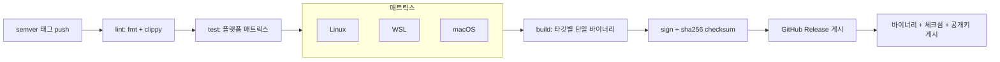

# 14. 배포 가이드
> **프로젝트명**: AI CLI 통합 리눅스 터미널
> **버전**: v1.0
> **작성일**: 2026-06-01
> **기술 스택**: Rust · ratatui · tokio · portable-pty · SQLite (대안: Go)
---

본 제품은 서버에 배포하는 웹 서비스가 아니라 **사용자 머신에 설치되는 CLI 도구**다. 따라서 배포 파이프라인은 빌드 → 서명 → 릴리스 채널 게시 → 사용자 설치 → 셸 hook 통합 순으로 구성된다. 도구 자신과 플러그인이 공격 표면이므로 서명·체크섬·다운그레이드 금지를 핵심으로 한다(`05-roadmap-enhancements-decisions.md` §29.11).

> 원천: 공급망 보안 → §29.11 · 셸 hook → §29.1, `06-mvp-implementation-spec.md` §31.1 · 플랫폼 capability → §31.11 · 진단/스모크 → `04-config-ops-testing.md` §23

## 1. 배포 개요

```text
빌드(타깃별) → 서명 + 체크섬 → 릴리스 채널(GitHub Release) → 설치(바이너리/패키지)
   → ai init shell (셸 hook 통합) → ai doctor (검증)
```

- 산출물: **서명된 단일 바이너리** + 체크섬 파일.
- 릴리스 채널: GitHub Release(태그 기반).
- 자동 업데이트: `auto_update = "notify"`(기본) — 알림만, 서명 검증 후에만 적용.
- 지원 플랫폼: Linux(우선) / WSL / macOS.

## 2. 사전 요구사항

| 항목 | 내용 |
|---|---|
| Rust toolchain | stable + `rustup` (대안 스택은 Go toolchain) |
| cross 빌드 타깃 | `x86_64-unknown-linux-gnu`(Linux/WSL 공용), `aarch64-unknown-linux-gnu`, `x86_64-apple-darwin`, `aarch64-apple-darwin`(macOS) |
| cross 도구 | `cross` 또는 GitHub Actions 매트릭스 러너 |
| 서명 키 | 릴리스 서명용 개인키(예: minisign/cosign ed25519). 공개키는 배포·검증용으로 공개 |
| 체크섬 | SHA-256 (`*.sha256`) 생성·게시 |
| `gh` CLI | GitHub Release 생성·자산 업로드 |
| 테스트 통과 | `13_테스트_보고서.md` 릴리스 판정 GO |

> 서명 개인키는 CI 시크릿(또는 OIDC keyless)로만 주입하고 리포지토리·로그에 절대 노출하지 않는다. 셸 hook 스니펫도 서명된 것만 주입한다(§29.11).

## 3. CI/CD 파이프라인



단계 설명:

| 단계 | 동작 | 실패 시 |
|---|---|---|
| lint | `cargo fmt --check`, `cargo clippy -D warnings` | 중단 |
| test | nextest + testcontainers, 플랫폼 매트릭스(§31.11 capability별) | 중단(보안 테스트 블로킹) |
| build | 타깃별 release 단일 바이너리(`--release`, strip) | 중단 |
| sign | 바이너리 서명 + `sha256sum` 생성 | 중단 |
| release | `gh release create` 태그로 생성, 자산 업로드 | 재시도 |

## 4. 릴리스 절차

1. **버전 확정**: semver(`MAJOR.MINOR.PATCH`). 사전 릴리스는 `-rc.N`.
2. **version monotonic 보장**: 새 버전은 직전 릴리스보다 반드시 커야 한다. 다운그레이드 공격 방지(`allow_downgrade = false`, §29.11)와 직접 연동된다.
3. **태깅**: `git tag vX.Y.Z && git push origin vX.Y.Z` → 파이프라인 트리거.
4. **GitHub Release**: 릴리스 노트, CHANGELOG, 마이그레이션/호환성 메모 첨부.
5. **체크섬·서명 게시**: 각 바이너리에 대해 `*.sha256`과 서명 파일을 함께 업로드. 검증용 공개키를 릴리스/문서에 명시.

```bash
# 체크섬 생성·게시 예시
sha256sum ai-terminal-x86_64-unknown-linux-gnu > ai-terminal-linux.sha256
gh release create vX.Y.Z \
  ai-terminal-x86_64-unknown-linux-gnu \
  ai-terminal-linux.sha256 \
  ai-terminal-linux.sig \
  --notes-file RELEASE_NOTES.md
```

## 5. 설치 / 업데이트

### 5.1 설치 (바이너리 / 패키지)

```bash
# 1) 다운로드
curl -fsSLO https://example/releases/vX.Y.Z/ai-terminal-x86_64-unknown-linux-gnu
curl -fsSLO https://example/releases/vX.Y.Z/ai-terminal-linux.sha256

# 2) 체크섬 검증
sha256sum -c ai-terminal-linux.sha256

# 3) 서명 검증 (공개키로) — 검증 실패 시 설치 중단
#    예: minisign -Vm <binary> -P <publickey>

# 4) 설치
install -m 0755 ai-terminal-x86_64-unknown-linux-gnu /usr/local/bin/ai
```

### 5.2 셸 hook 통합

설치 후 셸 통합을 활성화한다. rc 파일은 **자동 수정하지 않으며**(`auto_install_hooks = false`, §29.1) 명시적 명령으로만 변경하고, 설치 전 diff·dry-run·uninstall을 제공한다(§31.1).

```bash
ai init shell --dry-run   # 적용 없이 미리보기
ai init shell --diff      # 적용 예정 diff 표시
ai init shell             # 확인 후 삽입 블록 추가
ai init shell --uninstall # AI 터미널이 삽입한 블록만 제거(사용자 라인 보존)
```

삽입되는 블록(존재 시에만 평가, 미설치 시 무해):

```bash
# AI Terminal integration
if command -v ai >/dev/null 2>&1; then
  eval "$(ai shell-hook zsh)"   # bash는 'ai shell-hook bash'
fi
```

MVP 필수 지원 셸은 `bash`, `zsh`이며 Hook 미설치/비호환 시 Native Wrapper로 fallback한다(§31.1).

### 5.3 업데이트

```toml
[update]
auto_update = "notify"        # off | notify | auto
verify_signature = true
allow_downgrade = false
```

- 기본 `notify`: 새 버전을 **알림만** 하고 사용자가 적용 결정. 적용은 **서명 검증 통과 후에만**.
- `allow_downgrade = false`: 현재 버전보다 낮은 버전 설치 차단(다운그레이드 공격 방지, version monotonic, §29.11).
- 업데이트 후 설정 호환성 점검(§6) → 비호환 시 마이그레이션 안내.

## 6. 롤백

서버 무중단 배포가 아니라 **사용자 머신 바이너리 핀** 방식으로 롤백한다.

1. **이전 서명 바이너리로 핀**: 직전 정상 릴리스의 서명된 바이너리를 재설치. 단, `allow_downgrade = false`이므로 의도적 롤백은 사용자가 명시 승인하는 다운그레이드 경로로만 수행(자동 다운그레이드는 금지).

```bash
# 이전 정상 버전 재설치 (체크섬·서명 검증 후)
sha256sum -c ai-terminal-prev.sha256
install -m 0755 ai-terminal-prev /usr/local/bin/ai
```

2. **설정 호환성**: 새 버전이 추가한 설정 키는 이전 버전에서 무시되도록 하위 호환을 유지. 호환 불가 변경 시 설정 백업(`config.toml.bak`) 후 안내.
3. **셸 hook 정합성**: 바이너리만 교체하면 되며 hook 블록은 `command -v ai` 가드로 보호되어 그대로 동작. 필요 시 `ai init shell --uninstall`로 정리.
4. **데이터**: `ai-terminal.db`(WAL)는 하위 호환 스키마 유지. 비호환 마이그레이션은 롤백 전 백업 필수.

## 7. 배포 후 확인

설치/업데이트 직후 진단과 스모크 테스트를 수행한다.

### 7.1 진단 (`ai doctor`)

```bash
ai doctor                  # 전반 상태
ai doctor --guardrails     # 현재 플랫폼 guardrails capability 고지(§31.11)
ai doctor --metrics        # 외부 전송 없이 로컬 운영 메트릭(§29.5)
```

```text
AI Terminal Doctor
Shell:   bash 5.2 detected
PTY:     OK
AI provider: remote provider reachable
Sandbox: backend=auto → container detected / user namespace enabled / no-new-privileges enabled
Policy:  active profile: balanced
Masking: secret rules 3 loaded / pii rules 3 loaded
Context: cwd synchronized / git branch synchronized
```

### 7.2 스모크 테스트

| 항목 | 명령/동작 | 기대 |
|---|---|---|
| 일반 명령 | `ls -al` 실행 | 즉시 실행(입력 지연 ≤10ms 체감), Low 등급 |
| AI 명령 | `ai "현재 디렉터리 파일 개수"` | 명령 제안·설명 표시, 라우팅 ≤100ms |
| 마스킹 | secret 포함 컨텍스트로 원격 요청 | 마스킹 적용 / private key 감지 시 원격 차단 |
| Critical 차단 | `ai "루트 전부 삭제"`로 `rm -rf /` 유도 | 차단(실행 안 됨), 감사 로그 기록 |
| 셸 통합 | `cd /tmp` 후 컨텍스트 | AI cwd `/tmp` 반영 |

스모크 테스트 전 항목 통과 시 배포 완료로 판정한다. 실패 시 6. 롤백 절차로 이전 서명 바이너리에 핀한다.

> 테스트 정의 전체는 `11_테스트_전략서.md`, 릴리스별 실측 결과는 `13_테스트_보고서.md` 참조.
