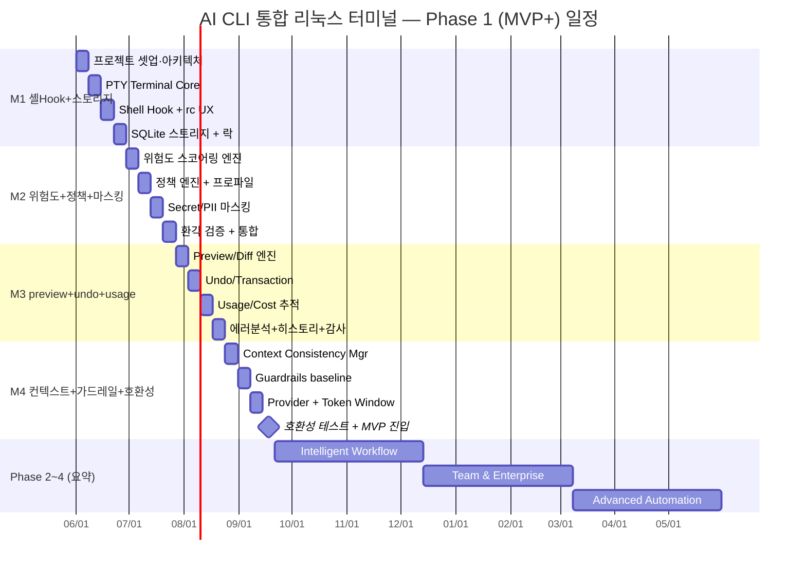

# 17. 스케줄
> **프로젝트명**: AI CLI 통합 리눅스 터미널
> **버전**: v1.0
> **작성일**: 2026-06-01
> **기술 스택**: Rust · ratatui · tokio · portable-pty · SQLite (대안: Go)
---

본 문서는 §25 Phase 로드맵, §30 구현 착수 결정안, §31.12 MVP 진입 승인 체크리스트를 기반으로 마일스톤·주차별 계획을 정의한다. 팀 구성은 3~5명, Agile 방식이며 Phase 1(MVP+)은 약 16주를 목표로 한다.

> 범위 정의는 `→ 01_프로젝트_계획서.md 참조` §1.4, 위험도/정책 구체값은 같은 문서 §3 참조.

---

## 1. 전체 로드맵 (ASCII 타임라인)

```text
2026 ─────────────────────────────────────────────────────────────────────────►
  Phase 1: MVP+ (약 16주)        Phase 2            Phase 3            Phase 4
  Safe AI 보조 터미널 최소제품    Intelligent        Team &             Advanced
                                 Workflow           Enterprise         Automation
  ┌──────────────────────────┐  ┌─────────────┐    ┌─────────────┐    ┌─────────────┐
  │ M1 셸Hook + 스토리지       │  │ Hybrid Mode │    │ 조직 정책    │    │ Cross-      │
  │ M2 위험도+정책+마스킹      │  │ Intent/Tool │    │ 중앙 감사    │    │ Session     │
  │ M3 preview+undo+usage     │  │ Semantic    │    │ 스킬 서명    │    │ Multi-agent │
  │ M4 컨텍스트동기화+가드레일 │  │ Index/Graph │    │ MCP mutate  │    │ Long-run    │
  │    +호환성테스트          │  │ 로컬LLM     │    │ 리모트(초기)│    │ 릴레이/대시 │
  │                          │  │ 스킬/MCP기본 │    │ gVisor      │    │ Firecracker │
  └──────────────────────────┘  └─────────────┘    └─────────────┘    └─────────────┘
       W1 ──────── W16            (요약)             (요약)             (요약)
```

Phase 정의(§25.3):

- **Phase 1 — MVP+**: 안전하고 실용적인 AI 보조 터미널 최소 제품. (본 문서 §3 상세)
- **Phase 2 — Intelligent Workflow**: 프로젝트 이해·반복 작업 보조 강화. Hybrid Mode, Multi-turn, Intent Classifier, Tool Use Planner, Verification Agent 기본, Semantic File Index, Project Knowledge Graph, 로컬 LLM, 통합 스킬 관리(§26) 기본, 통합 MCP 관리(§27) 기본.
- **Phase 3 — Team & Enterprise**: 조직 정책·감사·보안 통제 강화. 조직 정책 관리, 중앙 감사 로그, 팀별 프로파일, 엔터프라이즈 마스킹, gVisor 샌드박스, 스킬 서명, MCP mutate/external, 리모트 read-only 모니터링 → 원격 승인.
- **Phase 4 — Advanced Automation**: Cross-Session Knowledge, State Snapshot & Restore, Multi-agent workflow, Long-running task planner, IDE 연동, 웹 대시보드, Voice Input, Firecracker 고격리, 관리형 릴레이.

---

## 2. 마일스톤 정의

Phase 1(MVP+)은 §31.12 MVP 진입 승인 체크리스트의 9개 영역을 4개 마일스톤으로 묶는다. 각 마일스톤의 완료 기준은 해당 §31 절의 **수용 기준(acceptance criteria)** 과 일치한다.

| 마일스톤 | 기간 | 핵심 영역 | 완료 기준 (Definition of Done) | 근거 |
|---|---|---|---|---|
| **M1** | W1~W4 | 셸 Hook + 스토리지 | Hook 통합(bash/zsh), rc dry-run/diff/uninstall, Wrapper fallback / `ai-terminal.db` WAL + 6개 테이블 스키마 + 락 TTL + stale 복구. 동시 터미널 2개에서 DB corruption 없음 | §31.1, §31.2 |
| **M2** | W5~W8 | 위험도 엔진 + 정책 + 마스킹 | 0~100 위험도 점수 deterministic, Critical 100% 차단, balanced/paranoid 적용 / Secret·PII baseline, 마스킹 실패 시 원격 AI 차단, 원문 secret 디스크 미저장 | §31.3, §31.4, §31.8 |
| **M3** | W9~W12 | preview + undo + usage | 파일 변경 명령 diff preview, dry-run 우선, preview 불가 사유 표시 / best-effort undo(500MB·1000 files·TTL 7일) / 모든 AI 요청 usage event 기록, 예산 차단($2/$30) | §31.5, §31.6, §31.7 |
| **M4** | W13~W16 | 컨텍스트 동기화 + 가드레일 + 호환성 | cwd/git/shell 추적, env allowlist(secret 미저장), mismatch refresh / static analysis + timeout baseline, `ai doctor --guardrails` 플랫폼 capability 출력 / Provider capability map / 호환성·회귀 테스트 통과 | §31.9, §31.10, §31.11, §31.12 |

> 산출물: 각 마일스톤 종료 시 테스트 보고서를 `→ 13_테스트_보고서.md 참조` 형식으로 작성. M4 종료 시 §31.12 체크리스트 서명 → §31.13 최종 MVP 진입 결정.

---

## 3. Phase 1 (MVP+) 주차별 계획

각 주의 산출물은 관련 산출물 문서와 연결된다. 체크리스트는 구현·검수 항목이다.

### M1 — 셸 Hook + 스토리지 (W1~W4)

#### Week 1: 프로젝트 셋업 · 아키텍처 합의
- [ ] Rust 워크스페이스/크레이트 구성(ratatui·tokio·portable-pty·clap·tracing) — `→ 10_환경_설정_템플릿.md 참조`
- [ ] 6계층 아키텍처 합의, 일반 셸 경로 / AI 경로 분리 확정 — `→ 03_프로젝트_아키텍처_정의서.md 참조`
- [ ] Git 규칙·CI 스캐폴드(GitHub Actions) 구성 — `→ 09_Git_규칙_정의서.md 참조`
- [ ] 산출물: 빌드 가능한 빈 바이너리 + CI 파이프라인

#### Week 2: PTY Terminal Core
- [ ] portable-pty 기반 PTY Manager, bash/zsh spawn
- [ ] 입력/출력 렌더링(streaming, backpressure), Ctrl+C 핸들러 기초
- [ ] 일반 명령 입력 지연 ≤10ms 벤치 셋업 — `→ 11_테스트_전략서.md 참조`
- [ ] 산출물: 일반 셸로 동작하는 터미널(AI 없이 완전 사용 가능)

#### Week 3: Shell Hook 통합 + rc UX
- [ ] `ai init shell` / `--dry-run` / `--diff` / `--uninstall` 구현 (rc 자동 수정 금지)
- [ ] bash/zsh `preexec`/`precmd` hook 주입, hook IPC 수집(prompt/preexec/precmd/dir change/startup)
- [ ] Native Wrapper fallback 경로
- [ ] 산출물: hook 설치 후 cd·export·git branch 상태가 컨텍스트에 반영, hook 실패가 셸 사용 중단 안 함 (수용 기준 §31.1)

#### Week 4: SQLite 스토리지 + 파일 락
- [ ] `ai-terminal.db` WAL + PRAGMA(busy_timeout=5000) + 6개 테이블 DDL(sessions/commands/ai_requests/usage_events/audit_events/context_snapshots)
- [ ] 2층 락(advisory 파일 락 + `locks` 테이블), Lock TTL(db 10s/usage 10s/index 30m/policy 10s/session 세션 생존)
- [ ] stale lock 판정·정리(PID 부재/heartbeat 초과/owner 종료/mtime 초과) → audit 기록 → 제거 → 재시도
- [ ] 산출물: **M1 완료** — 동시 2 터미널 무손상, stale 복구 (수용 기준 §31.2)

### M2 — 위험도 엔진 + 정책 + 마스킹 (W5~W8)

#### Week 5: 위험도 스코어링 엔진 (0~100)
- [ ] 명령 유형 점수표(read-only +0 / 파일 삭제 +35 / 재귀 삭제 +30 / sudo +40 / 디스크 조작 +80 / 다운로드 후 실행 +50 등)
- [ ] 경로 가중치(cwd +0 / `$HOME` +30 / `/etc`·`/usr`·`/bin` +50 / `/var/run/docker.sock` +70 등) + 완화 요소(dry-run −20 / preview −10 등)
- [ ] 등급 매핑(Low 0~24 / Medium 25~49 / High 50~79 / Critical 80~100)
- [ ] 산출물: deterministic 점수, 동일 명령·환경 동일 점수 (수용 기준 §31.4)

#### Week 6: 정책 엔진 + 프로파일
- [ ] `balanced`(기본)·`paranoid` 프로파일 전체 필드(confirm_level, block_critical, auto_healing_max_attempts=1, remote_approval=false 등)
- [ ] 정책 액션 매핑(Critical 차단 / High 강한 확인+sandbox / paranoid 원격 AI 차단)
- [ ] `ai policy show` / `ai policy set paranoid` 즉시 반영
- [ ] 산출물: 두 프로파일 모두 Critical 차단, AI Low여도 로컬 High면 High 적용 — `→ 07_요구사항_정의서.md 참조` (FR-SEC, NFR-SEC)

#### Week 7: Secret/PII 마스킹 파이프라인
- [ ] Secret 탐지(API key/Bearer·OAuth·Refresh token/Password/SSH private key/AWS key/GitHub·Slack token 등)
- [ ] PII 탐지(이메일/IPv4/전화번호/한국 주민등록번호 패턴/신용카드 유사 등) + 마스킹 규칙(yaml)
- [ ] 파이프라인 순서(Raw → Secret Detection → PII Detection → Masking → Validation Scan → Remote Eligibility), 엔트로피 보완 fail-closed
- [ ] 산출물: `.env` 원격 컨텍스트 제외, private key 감지 시 원격 차단, 마스킹값만 로그 저장 (수용 기준 §31.8)

#### Week 8: 환각 검증 게이트 + 통합
- [ ] 바이너리 존재 검증(`command -v`/`which`), 미존재 시 패키지 추천/차단 (플래그 검증은 Phase 2)
- [ ] AI 요청 타임아웃(5/15/60/180s) + Ctrl+C 취소 + Graceful Recovery 완성
- [ ] M1+M2 통합 테스트 — `→ 11_테스트_전략서.md 참조`
- [ ] 산출물: **M2 완료** — 위험도+정책+마스킹 end-to-end 동작, 마스킹 누락 0건·Critical 차단 100% 검증

### M3 — preview + undo + usage (W9~W12)

#### Week 9: Preview / Diff 엔진
- [ ] preview 필수 대상(`sed -i`, formatter, codemod, rm, chmod, 설정 파일 수정 등) 분류
- [ ] dry-run 우선 도구(`rsync --dry-run`, `git clean -n`, `terraform plan`, `kubectl --dry-run=client` 등)
- [ ] diff 생성(대상 목록 → 임시 복사 → 임시본 실행 → diff → 확인 후 적용), preview 불가 사유 표시
- [ ] 산출물: `sed -i`류 diff 표시, `rm -rf ./path` 대상 목록·개수 표시, preview 실패 시 원본 미수정 (수용 기준 §31.5)

#### Week 10: Undo / Transaction 계층
- [ ] best-effort 파일 롤백(단일/제한적 다중 파일, formatter·sed/perl 백업), git stash / trash 기반
- [ ] 백업 상한(500MB / 1000 files / 파일 20MB / TTL 7일), metadata.json + files/ 저장
- [ ] `ai undo last`, undo 불가 명령 사유 표시
- [ ] 산출물: 한도 초과 시 사전 고지, 백업 실패 시 위험 명령 중단 (수용 기준 §31.6)

#### Week 11: Usage / Cost 추적
- [ ] usage_event 스키마(input/output/cached tokens, token_count_source, cost_source, estimated)
- [ ] 예산 동작(session $2 / month $30, warn 80% / block 100%), 로컬 LLM 비용 0 표시
- [ ] `/usage` 표시, 부정확 비용 estimated 배지
- [ ] 산출물: 모든 AI 요청 usage event 기록, 예산 초과 시 원격 AI 차단 (수용 기준 §31.7)

#### Week 12: 에러 분석 + 히스토리 + 감사
- [ ] `ai explain last-error`(직전 명령·종료 코드·stderr·cwd 기반)
- [ ] 세션 히스토리, audit_events 기록(민감 정보 미저장)
- [ ] M3 통합 테스트
- [ ] 산출물: **M3 완료** — preview/undo/usage/에러분석 동작

### M4 — 컨텍스트 동기화 + 가드레일 + 호환성 (W13~W16)

#### Week 13: Context Consistency Manager
- [ ] 필수 추적(cwd/last_command/last_exit_code/shell/hostname/user/git_root/git_branch/git_dirty/policy_profile/ai_mode)
- [ ] 상태 갱신 트리거 built-in(cd/pushd/export/alias/source/git checkout·switch·pull·reset 등), alias 충돌 감지
- [ ] env allowlist(PATH/SHELL/USER/HOME/PWD/VIRTUAL_ENV 등) + denylist(`.*TOKEN.*`/`.*SECRET.*`/`.*KEY.*`/`.*PASSWORD.*`), PATH hash-only
- [ ] 산출물: `cd`/`git switch` 후 갱신, env secret 미저장, mismatch 시 refresh 제안 (수용 기준 §31.10)

#### Week 14: Execution Guardrails Engine (baseline)
- [ ] Baseline(모든 플랫폼): static analysis, risk scoring, preview/diff, timeout, process group termination, confirmation, masking, policy enforcement
- [ ] Linux MVP 우선(file count pre-scan, Docker socket 차단, 시스템 경로 차단, sandbox resource limit)
- [ ] `ai doctor --guardrails` 플랫폼 capability matrix 출력(Linux/WSL/macOS)
- [ ] 산출물: 미지원 guardrail 조용한 실패 금지·명시, 동적 감시 제한 플랫폼 High+ 확인 강화 (수용 기준 §31.11)

#### Week 15: Provider 추상화 + Token Window
- [ ] AIProvider 최소 인터페이스 + capability map(streaming/json_mode/tool_use/token_counting/usage_reporting/max_context 등)
- [ ] fallback(streaming 미지원→non-streaming, token counting 미지원→estimated, JSON mode 미지원→보수 파서), tool-use MVP 제외
- [ ] Token Window Management 기본(chunk/window/budget)
- [ ] 산출물: capability registry 로드, 미지원 기능 명시적 fallback (수용 기준 §31.9)

#### Week 16: 호환성 테스트 + MVP 진입 결정
- [ ] 셸 호환성 테스트(bash/zsh), 플랫폼 테스트(Linux/WSL/macOS)
- [ ] LLM 비결정성 회귀 테스트(속성 기반 검증, golden set, N회 샘플링 안정성) — `→ 11_테스트_전략서.md 참조`
- [ ] KPI 검증(입력 지연 ≤10ms / AI 라우팅 ≤100ms / 짧은 응답 ≤3s / 마스킹 누락 0 / Critical 차단 100% / 커버리지 ≥80%)
- [ ] §31.12 9개 영역 체크리스트 서명 → §31.13 최종 MVP 진입 결정
- [ ] 산출물: **M4 완료 — MVP+ 출시 준비 완료**

---

## 4. Phase 2~4 요약

| Phase | 기간 | 주요 산출물 |
|---|---|---|
| **Phase 2 — Intelligent Workflow** | MVP+ 이후 | Hybrid Mode, Multi-turn, Intent Classifier, Tool Use Planner, Verification Agent 기본, Semantic File Index, Project Knowledge Graph, 로컬 LLM(Ollama), 정확 캐시→시맨틱 캐시, 데몬 아키텍처(조건 충족 시), 통합 스킬 관리(§26) 로컬, 통합 MCP 관리(§27) 로컬 read-only |
| **Phase 3 — Team & Enterprise** | Phase 2 이후 | 조직 정책 관리(signed policy.d), 중앙 감사 로그, 팀별 프로파일, 엔터프라이즈 마스킹, Debug Bundle, Guardrails 고도화, gVisor 샌드박스, 스킬 서명·조직 레지스트리, MCP mutate/external·OAuth, 리모트(§28) read-only 모니터링→원격 승인 |
| **Phase 4 — Advanced Automation** | Phase 3 이후 | Cross-Session Knowledge, State Snapshot & Restore, Multi-agent workflow, Long-running task planner, IDE 연동, 웹 대시보드, Voice Input, Firecracker 고격리, 관리형 릴레이·멀티 디바이스 |

> Phase 2~4의 상세 일정은 Phase 1 완료 후 회고를 거쳐 확정한다. <!-- TODO: Phase 2 이후 구체 주차 계획은 MVP 회고 후 수립 -->

---

## 5. Mermaid Gantt 차트



> Phase 2~4 막대는 개략 표기이며 실제 기간은 회고 후 확정한다.
